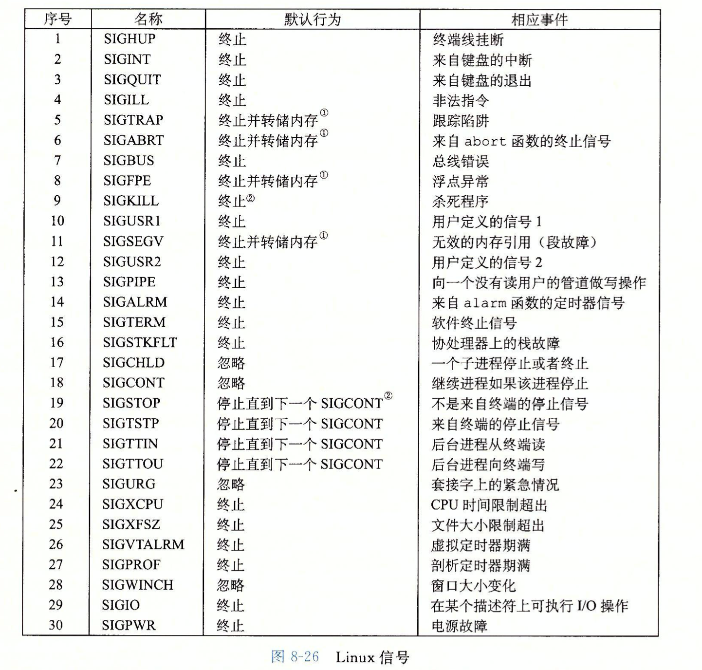

# shell-lab

## 实验要求

补全`tsh.c`中剩余的代码：

- `void eval(char *cmdline)`：解析并执行命令。
- `int builtin_cmd(char **argv)`：检测命令是否为内置命令`quit`、`fg`、`bg`、`jobs`。
- `void do_bgfg(char **argv)`：实现`bg`、`fg`命令。
- `void waitfg(pid_t pid)`：等待前台命令执行完成。
- `void sigchld_handler(int sig)`：处理`SIGCHLD`信号，即子进程停止或终止。
- `void sigint_handler(int sig)`：处理`SIGINT`信号，即来自键盘的中断`ctrl-c`。
- `void sigtstp_handler(int sig)`：处理`SIGTSTP`信号，即终端停止信号`ctrl-z`。

## 实验操作

信号机制：

## 相关重要函数

~~~c
int  sscanf( string str, string fmt, mixed var1, mixed var2 ... );  
~~~

sscanf与scanf类似，都是用于输入的，只是后者以屏幕(stdin)为输入源，前者以固定字符串为输入源。