# CSAPP-第八章-异常

> ECF - 异常控制流。

处理器检测到有事件发生的时候，会有一张`异常表`的`跳转表`，进行间接过程调用，到`异常处理程序(exception handler)`.

## 异常

系统中可能的每一种类型的异常都分配了一个唯一的非负整数的`异常号`。

在操作系统启动的时候，操作系统分配和初始化一个叫`异常表`的`跳转表`。

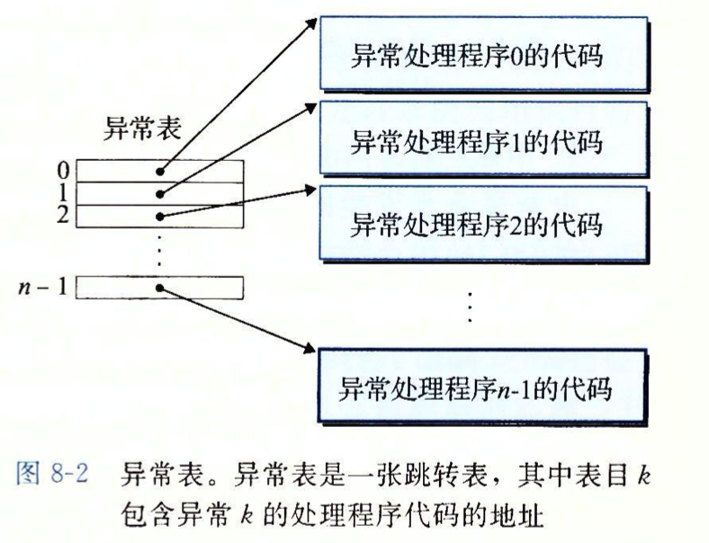

运行的时候`处理器`检测到发生事件，确定`异常号`，处理器就会触发异常。

异常触发步骤：

1. 处理器检测到异常
2. 确定`异常号`
3. 通过`异常号k`在异常表（`异常表基址寄存器`）查找到相关表项
4. 转到相应的处理程序

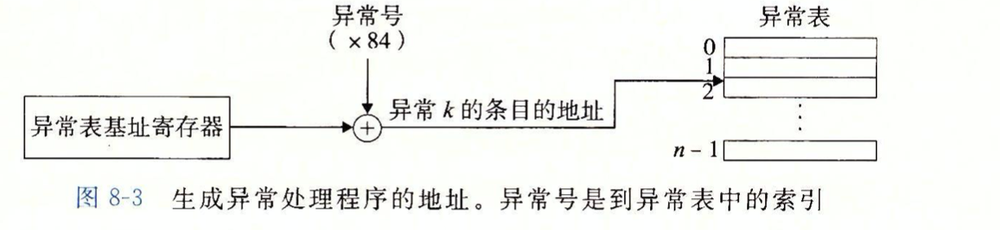

异常处理完成之后，根据引起异常的事件的类型，会发生3种情况中的一种：

* 处理程序返回，事件发生时正在执行的指令。
* 处理程序返回，返回到没有发生异常将会执行的`下一条指令`。
* 处理程序被中断的程序（处理程序也可能被中断奥）。

`异常处理注意`

* 处理器在异常处理的时候也可能把一些额外的处理器状态压倒栈里面，处理程序返回的时候会恢复这些状态。
* 如果控制器从用户程序转移到内核，所有项目都被压倒内核栈里面，而不是压倒用户栈里面。
* 异常处理运行在内核态的时候拥有一切访问权限。

`异常的类别`

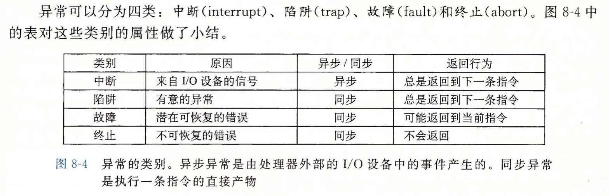

`中断`

* 中断时异步发生的,其它的都是同步发生的，中断如下：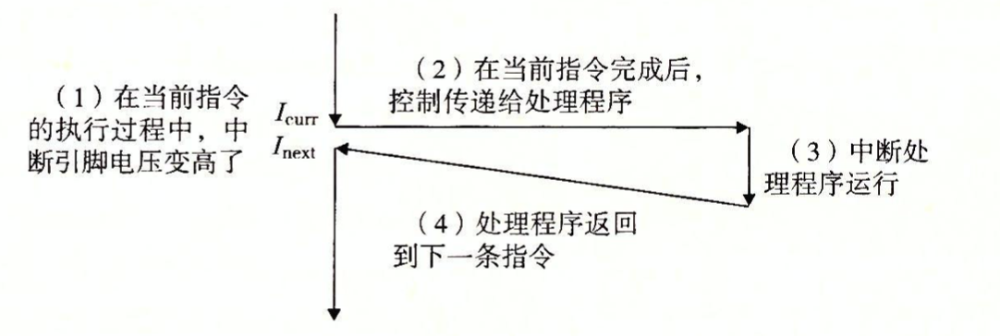
* 其他的异常统称为`故障指令`。

 `陷阱和系统调用`

> 陷阱最重要的用途是在用户程序和内核之间提供一个像过程一样的接口，叫做系统调用。

处理器提供`syscall`指令，它会导致一个到异常处理程序的陷阱，这个处理程序解析参数，调用合适的内核程序。

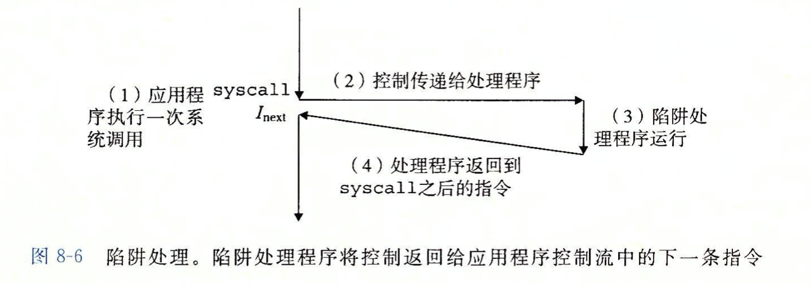

`故障`

它由错误引起，可能被故障处理程序修正。

*  修正成功：返回引起故障的指令再次执行。
* 修正失败：返回到内核`abort`例程，终止程序。

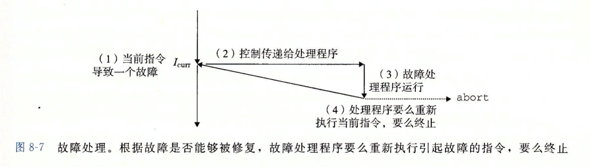

`终止`

不可恢复的致命性错误，这个就没啥好说的，直接`abort`终止程序。

`Linux/x86-64系统的异常`

其有256种不同的异常类型，0-31来自于`Intel架构师`，对任何`x86/64`一样，32~255操作系统定义。

经典异常号

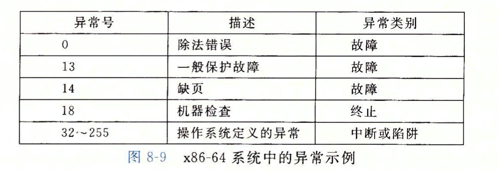

`Linux/86-64系统调用`

对于系统调用，`系统调用号`对应了很多的`内核跳转表的偏移量（区别于异常表）`

## 进程

`基本概念`

* 多任务(multitasking)：一个进程和其它进程轮流执行。

`私有地址空间`

> 一般而言，和这个空间里面某个地址相关联的那个内存字节是不能被其他进程读或者写的，这个意义上说，这个地址空间是私有的。

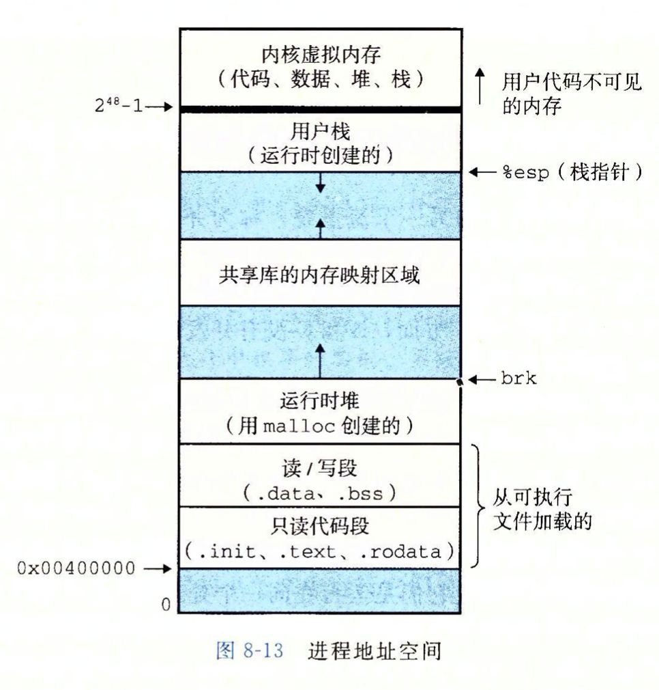

`用户模式和内核模式`

处理器提供了一种机制，限制一个应用可以执行的命令以及它可以访问的地址空间范围。

* 寄存器模式位`mode bit`，其描述了当前享有的特权。
  * 设置模式位进入内核模式
* 用户态到内核态
* 通过`异常`，异常发生控制异常处理程序，将用户模式变为内核模式。

**Linux提供了一个重要的数据结构，/proc文件系统，进而允许用户模式访问内核数据结构的内容。/proc文件系统把很多内核数据结构输出为一个用户程序可读的文本文件层次结构。**

`上下文切换`

内核通过`上下文切换(context switch)`异常控制流实现多任务。

`上下文`：内核重新启动一个被抢占的进程所需的状态。

* 通用寄存器，用户栈之类的。。

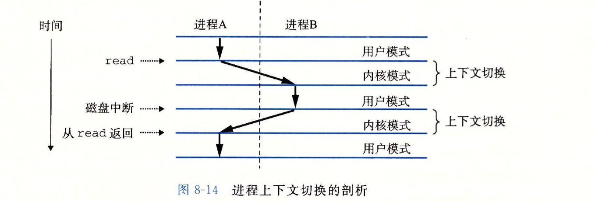

## 进程控制

> 记录自己记得不清楚的点。

`init`进程：其在系统启动的时候创建，是所有进程的祖先，如果一个父进程没有回收它的僵死子进程就终止了，那么内核会安排`init进程`去回收他们。

`waitpid函数`

~~~c
#include<sys/types.h>
#include<sys/wait.h>
pid_t waitpid(pid_t pid,int *statusp,int options);
~~~

默认情况`options=0`，waitpid挂起调用进程的执行，直到它的`等待集合`中的一个子进程终止。如果等待集合里面的一个进程在调用的时候就已经终止了，那么`waitpid`就立刻返回，`waitpid`返回导致waitpid返回的已终止的子进程的`PID`,此时子进程已经被回收，内核会冲系统中删除掉它的所有痕迹。

1. 判定等待集合的成员（由参数pid来判定）
   1. 如果pid>0，等待集合就是一个单独的子进程，进程id=pid
   2. 如果pid=-1,那么等待集合就是由父进程所有的子进程组成的,但是只要有一个子进程结束就会返回。
2. 修改默认行为
   1. `options`选项：
      1. 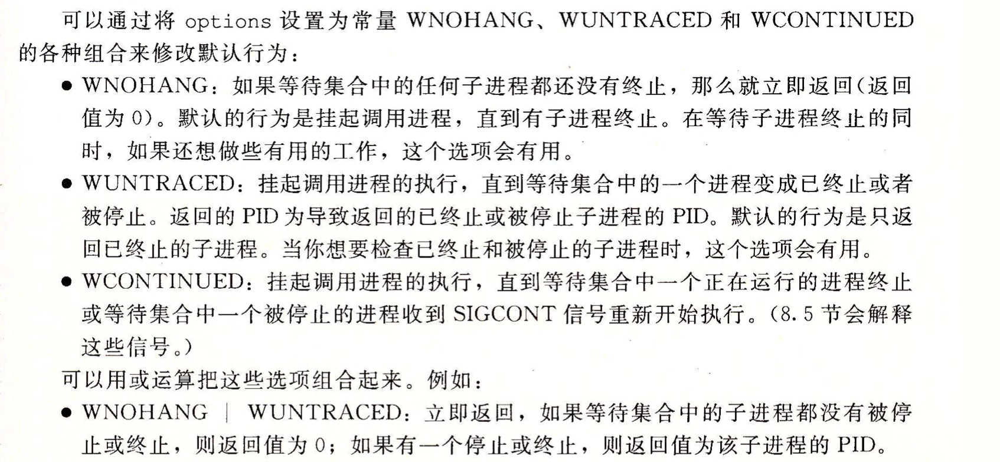
   2. `statusp`参数：
      1. 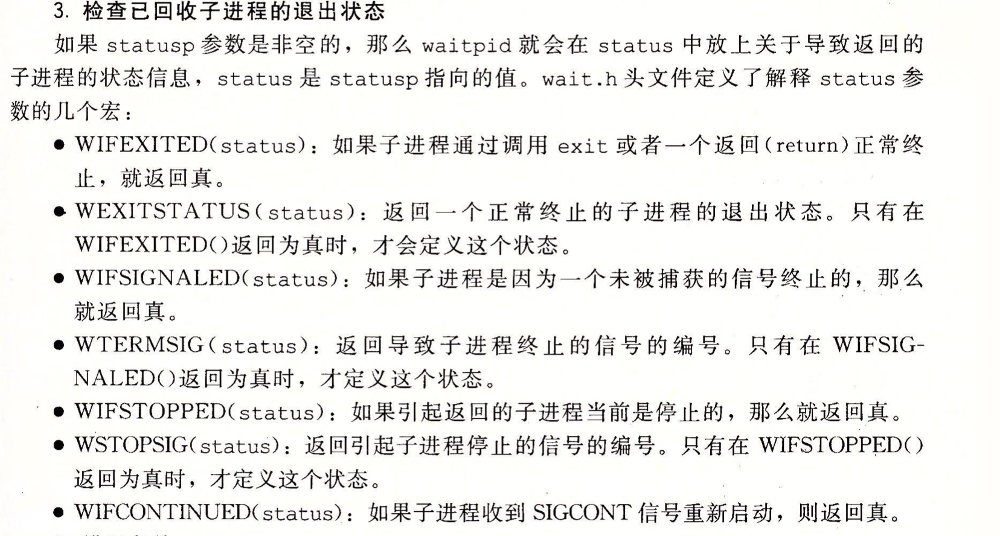
3. 如果没有调用子进程，`waitpid`返回-1，并且设置`errno`为`ECHILD`，如果`waitpid函数`被一个信号中断，它返回`-1`，设置`errno`为`EINTR`.

测试案例：

~~~c
#include<stdio.h>
#include<sys/types.h>
#include<sys/wait.h>
#include<errno.h>
int main()
{
    int statu,i;
    pid_t pid;
    for(i=0;i<10;i++)
    {
        if((pid=fork())==0)
        {
            exit(100+i);
        }
    }
    while(((pid = waitpid(-1,&statu,NULL))>0))
    {
        if(WIFEXITED(statu))
        {
            printf("child process pid = %d over normally with statu  = %d\n",pid,WEXITSTATUS(statu));
        }
        else
        {
            printf("child process pid = %d over over over\n",pid);
        }
    }
    if(errno != ECHILD)
    {
        printf("waitpid error\n");
        exit(-1);
    }
    return 0;
}
~~~

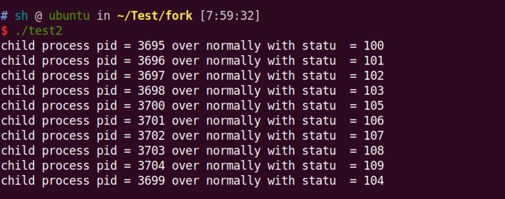

看出程序不会按照特定顺序回收子进程。

测试2：

~~~c
#include<stdio.h>
#include<sys/types.h>
#include<sys/wait.h>
#include<errno.h>
int main()
{
    int statu,i;
    pid_t pid[10];
    for(i=0;i<10;i++)
    {
        if((pid[i]=fork())==0)
        {
            exit(100+i);
        }
    }
    i=0;
    pid_t repid;
    while(((repid = waitpid(pid[i],&statu,NULL))>0))
    {
        if(WIFEXITED(statu))
        {
            printf("child process pid = %d over normally with statu  = %d\n",repid,WEXITSTATUS(statu));
        }
        else
        {
            printf("child process pid = %d over over over\n",repid);
        }
        i++;
    }
    if(errno != ECHILD)
    {
        printf("waitpid error\n");
        exit(-1);
    }
    return 0;
}
~~~

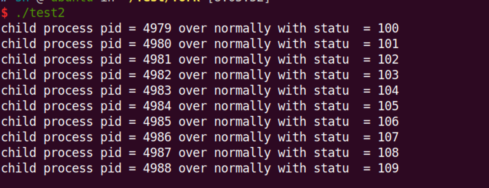

这样子进程可以按照特定顺序被回收。

`加载并运行程序`

~~~c
#include<unistd.h>
int execve(const char *filename,const char *argv[],const char *envp[]);
~~~

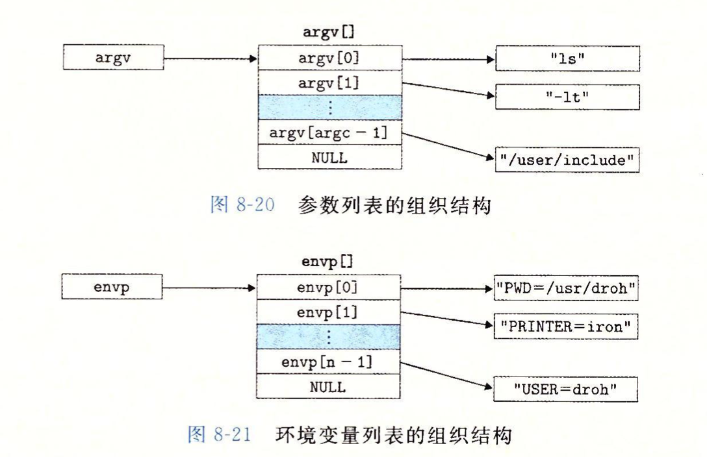

环境变量字符串都是`键值对`的形式。

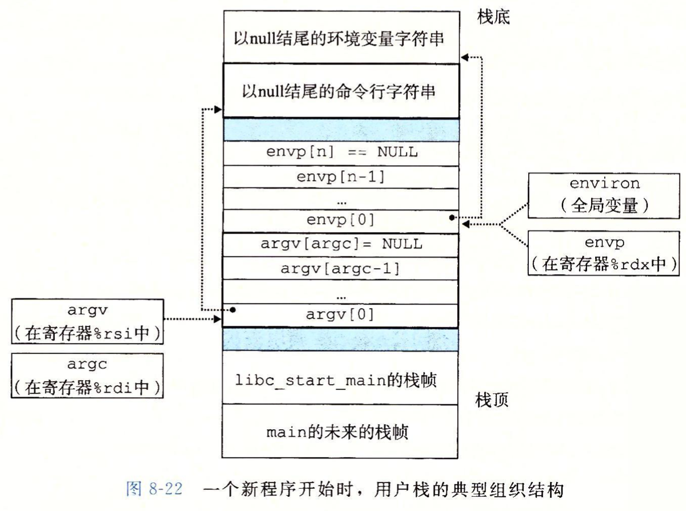

这个点倒是没有注意到哎**在栈的顶部是系统启动函数libc_start_main**的栈帧。

`操作环境数组`

~~~c
#include<stdlib.h>
char *getenv(const char *name);
~~~

该函数搜索键值对里面的`name`返回一个执行`value`的指针，否则返回`NULL`.

~~~c
#include<stdlib.h>
int setenv(const char* name,const char* newvalue, int overwrite); //成功返回1，失败返回0
void unsetenv(const char  *name);
~~~

理解`envp`和`argv`

~~~c
#include<stdio.h>
#include<stdlib.h>
int main(int argc,char *argv[],char *envp[])
{
    printf("command line argv is :\n");
    for(int i=0;argv[i]!=NULL;i++)
    {
        printf("          argv[%d] =  %s\n",i,argv[i]);
    }

    printf("envp is :\n");
    for(int i=0;envp[i]!=NULL;i++)
    {
        printf("          envp[%d] =  %s\n",i,envp[i]);
    }
    return 0;
}
~~~

## 信号

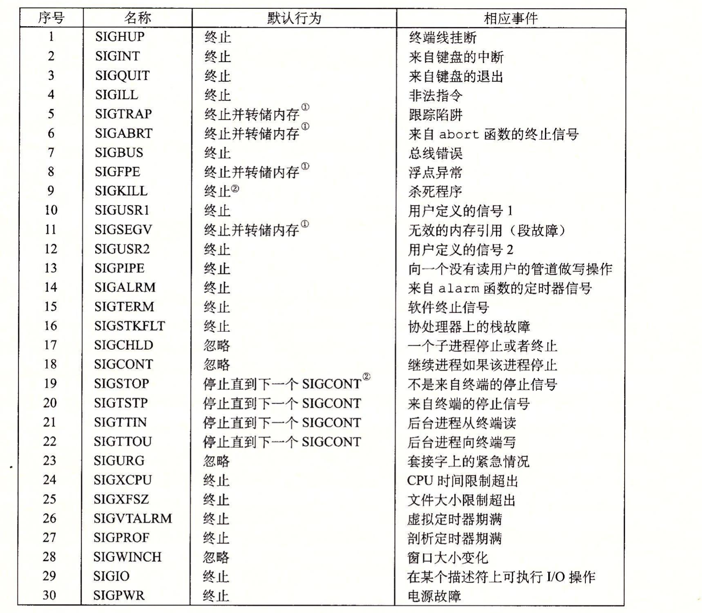

底层的硬件异常都是由内核处理程序运行的，正常情况下，对用户而言是不可见的，信号提供了一种机制可以通知用户发生了这种异常。

值得注意的几个信号机制：

* `ctrl+C`内核会发送`SIGINT`给这个前台进程组里面的每个进程。
* 一个进程可以通过向另一个进程发送`SIGKILL`信号终止它。
* 当一个子进程终止的时候，内核会发送一个`SIGCHLD`信号给父进程。
* `ctrl+z`内核会发送一个`SIGTSTP`信号到前台进程组中的每一个进程，一般是停止（挂起）前台作业。

**信号处理规则**

一个发出但是没有被接受的信号叫做`待处理信号`，**任何时刻，一种类型至多只会有一个待处理信号**，如果一个进程有一个类型为K的信号，那么任何接下来发送到这个进程的类型为K的信号都会被丢弃。

信号阻塞：一个进程可以选择性的阻塞接受某种信号，当某种信号阻塞的时候，它仍然可以被发送，但是产生的待处理信号不会被接受，直到进程取消对这种信号的阻塞。

内核在`pending`位向量中维护着待处理信号的集合，在`blocked`位向量中维护着被阻塞的信号集合。

* 传送一个类型为k的信号，内核设置`pending`第k位，接受了一个类型k信号，内核会清除`pending`第k位。
* 传送一个类型为

位向量：

> 位向量，也叫位图，是一个我们经常可以用到的数据结构，在使用小空间来处理大量数据方面有着得天独厚的优势。位向量，顾名思义就是「位构成的向量」，我们通常使用0来表示 false，1来表示 true，例：[010111] 我们就可以说它是一个位向量，它表示 [false true false true true true]。在位向量这个数据结构中，**我们常常把它的索引和它的值对应起来使用**。

## 进程组

信号机制基于`进程组`概念。

~~~c
#include<unistd.h>
pid_t getpgrp(void); //返回进程的进程组ID
~~~
~~~c
#include<stdio.h>
#include<unistd.h>
int main()
{
    
    pid_t pid = getpgrp();
    pid_t pid2 = getpid();
    printf("进程组ID %d\n",pid);
    printf("进程ID %d\n",pid2);
    pid_t pid3;
    if((pid3=fork())==0)
    {
        pid_t pid4 = getpgrp();
        printf("子进程组ID %d\n",pid4);
        exit(0);
    }
    printf("子进程ID = %d\n",pid3);
    waitpid(-1,NULL,NULL);
    return 0;
}
~~~

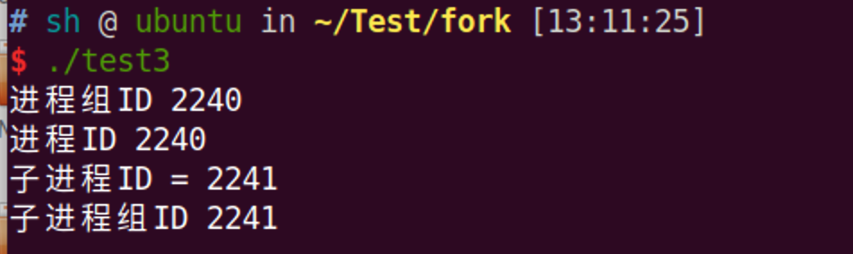

默认子进程和父进程同属一个进程组，可以通过`setpgid`函数改变自己或者其他进程的进程组。

~~~c
#include<unistd.h>
int setpgid(pid_t pid,pid_t pgid);
~~~

将进程`pid`的进程组改变为`pgid`,如果`pid`为0，那么就使用当前进程的PID。如果`pgid`为0，那么就用`pid`指定的进程的`PID`作为进程组`ID`.

~~~c
#include<stdio.h>
#include<unistd.h>
int main()
{
    
    pid_t pid = getpgrp();
    pid_t pid2 = getpid();
    printf("进程组ID %d\n",pid);
    printf("进程ID %d\n",pid2);
    pid_t pid3;
    if((pid3=fork())==0)
    {
        sleep(1);
        pid_t pid4 = getpgrp();
        printf("子进程组ID %d\n",pid4);
        exit(0);
    }
    setpgid(pid3,pid);
    printf("子进程ID = %d\n",pid3);
    waitpid(-1,NULL,NULL);
    return 0;
}
~~~

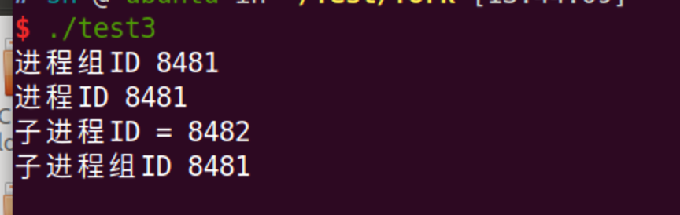

`/bin/kill程序发送信号`

> linux >/bin/kill -9 15213

其中 9 是信号量ID，这代表发送`SIGKILL`信号给进程组`151213`中的每一个进程。

`从键盘发送信号`：

> linux > ls | sort

linux 用`job`这个抽象概念来表示对一条命令行求值而创建的进程。

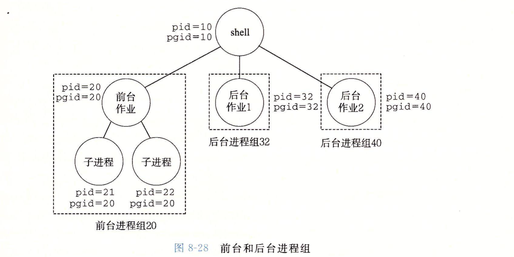

任何时刻，至多有一个前台作业和0个或者多个后台作业。

shell 为每个作业创建独立的进程组，进程组ID通常取自作业中父进程中的一个。

`kill函数发送信号`

~~~c
#include<sys/types.h>
#include<signal.h>
int kill(pid_t pid,int sig);
~~~

* pid>0:发送个特定进程`sig`信号
* pid=0:发送信号`sig`给调用进程所在进程组的每一个进程，包括调用进程自己。
* pid<0: 发送信号`sig`给进程组`|pid|（pid的绝对值）`中每个进程。

`alarm函数发送信号`

~~~c
#include<unistd.h>
unsigned int alarm(unsigned int secs); //返回前一次闹钟剩余的秒数，若没有设定闹钟，则为0
~~~

`alarm`函数安排内核在`secs`秒后发送一个`SIGALRM`信号给调用进程。

* 任何情况下，调用`alarm`都会取消任何待处理的`闹钟`，并且返回闹钟剩下的秒数。
* 如果没有任何等待处理的闹钟，就返回0。

`接收信号：`

内核把进程p从内核模式切换到用户模式。

1. 检查未被阻塞的信号集合(`pending&~blocked`),集合为NULL那么内核控制传递到进程下一条逻辑指令。
2. 如果非NULL，那么内核悬着集合里面某个信号k`通常是最小的k`并且强制进程接受该信号。
3. 每种信号都有一种预定义的默认行为：
   1. 进程终止
   2. 进程终止并转储内存
   3. 进程停止（挂起）直到被`SIGCONT`信号重启
   4. 进程忽略该信号。
4. **进程可以通过使用`signal`函数修改和信号相关联的默认行为**。
   1. 但是`SIGSTOP`和`SIGKILL`默认行为不可更改。

~~~c
#include<signal.h>
typedef void (*sighandler_t)(int); //这是把void 定位为一个函数指针了？。。。
sighandler_t signal(int signum,sighandler_t handler);//若成功则为指向前次处理程序的指针，若出错则为SIG_ERR(不设置errno)
~~~

* 如果`handler`是`SIG_IGN`那么忽略类型为`signum`的信号。
* 如果`handler`是`SIG_DFL`，那么类型为`signum`的信号恢复默认行为。
* 否则,`handler`是用户定义的函数的地址，这个函数就是`信号处理程序`。

~~~~c
#include<stdio.h>
#include<signal.h>
void sigint_handler(int sig)
{
    printf("Caught SIGINT!!!\n");
    exit(0);
}
int main()
{
    if(signal(SIGINT,sigint_handler) == SIG_ERR)
    {
        printf("error!!!\n");
        exit(0);
    }
    pause();
    return 0;
}
~~~~

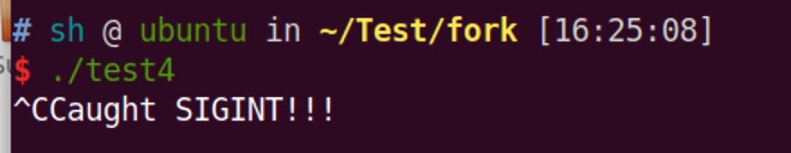

练习8.7

~~~c
#include<stdio.h>
#include<signal.h>
unsigned int snooze(unsigned int secs)
{
    unsigned int left = sleep(secs);
    printf("process sleep %llds \n",secs-left);
    return secs-left;
}
void sigint_handler(int sig)
{
    printf("Caught SIGINT = %d!!!\n",sig);
}
int main(int argc,char *argv[])
{
    if(signal(SIGINT,sigint_handler) == SIG_ERR)
    {
        printf("error!!!\n");
        exit(0);
    }
    snooze(atoi(argv[1]));
    return 0;
}
~~~

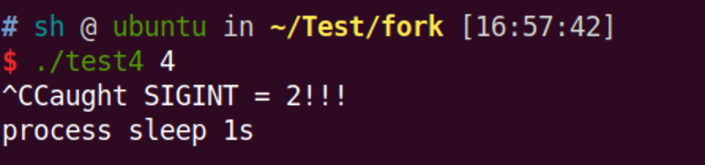

`阻塞和解除信号`

隐式阻塞机制：

* 内核默认阻塞`当前处理程序`正在处理信号类型的信号。

显示阻塞机制：

* 应用程序使用`sigprocmask`函数和它的辅助函数，明确的阻塞和解除阻塞信号。

~~~c
#include<signal.h>
int sigprocmask(int how,const sigset_t *set,sigset_t *oldset);
int sigemptyset(sigset_t *set);
int sigdelset(sigset_t *set,int signum);
int sigdelset(sigset_t *set,int signum); //如果成功则返回0，出错返回-1
int sigismember(const sigset_t *set,int signum); //若signum是set的成员则为1，如果
int sigfillset(sigset_t *set); //把set对应的信号集初始化，把所有的信号加入到此信号集里面，成功返回0，失败返回-1.
~~~

`sigprocmask`函数改变当前阻塞的信号集合（`blocked位向量`）具体行为依赖于`how`的值。

* `SIG_BLOCK`:把`set`里面的信号添加到`blocked`中（blocked=blocked | set）.
* `SIG_UNBLOCK`:从`blocked`中删除`set`中的信号。
* `SIG_SETMASK`:block=set

如果`oldset`非空，那么`blocked`位向量保存在`oldset`中。

~~~c
#include<stdio.h>
#include<signal.h>
int main()
{
    sigset_t mask,prev_mask;
    sigemptyset(&mask); //信号机初始化为空
    sigaddset(&mask,SIGINT); //添加相关信号到信号集
    sigprocmask(SIG_BLOCK,&mask,&prev_mask); //把信号集里面的信号添加到block
    sigprocmask(SIG_SETMASK,&prev_mask,NULL); //恢复原来的信号集
    return 0;
}
~~~

`编写信号处理程序`

* 处理程序与主程序并发运行。
* 处理程序与主程序共享同样的全局变量
* 不同的系统有不同的信号处理语义。

注意事项：

* 处理程序要尽可能简单。
* 在处理程序中只调用异步信号安全的函数。异步安全：
  * 可重入，比如访问只局部变量
  * 或者它不可以被信号处理程序中断。

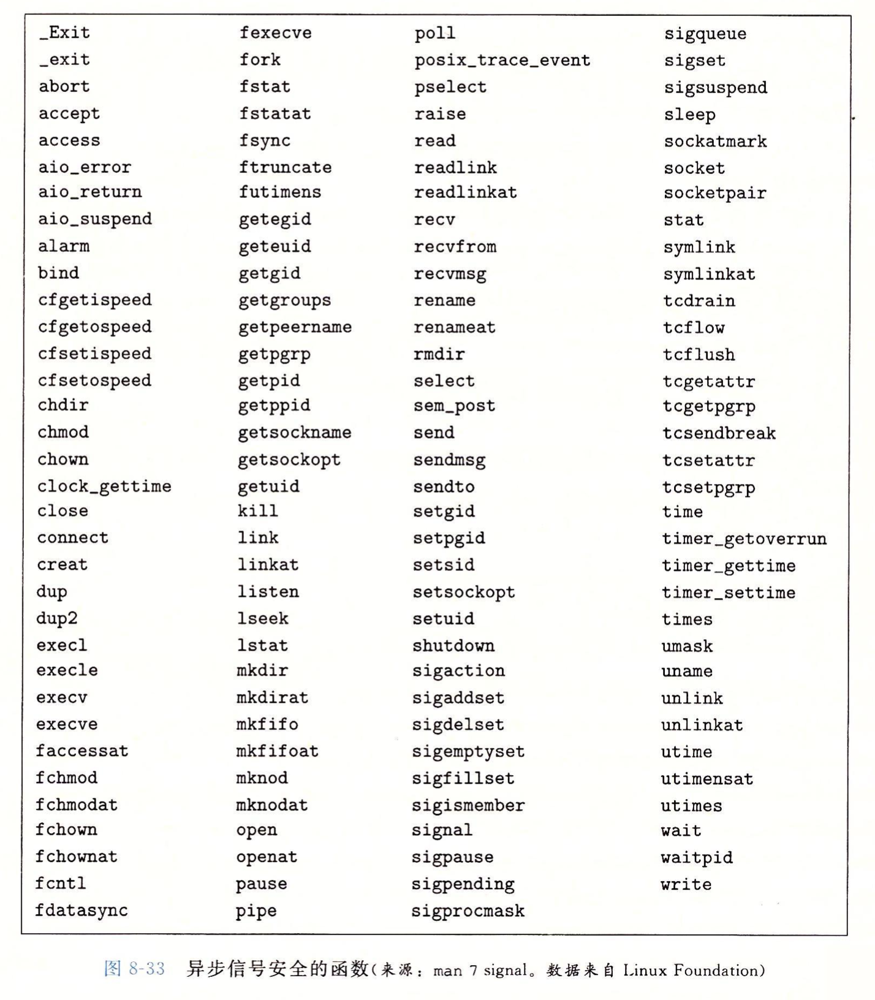

* `保存和恢复errno`,许多`Linux异步信号`安全的函数都会在出错返回时设置`errno`,进入处理程序的时候把errno保存在一个局部变量里面，处理程序返回前恢复它，但是只有当处理器有返回时才需要，比如`exit`了，就不需要了.
* 阻塞所有信号，保护对共享全局数据结构的访问。
* 用`volatile`声明全局变量，这用来告诉编译器不要缓存这个变量。
* `sig_atomic_t`声明标志，C提供了该整形数据结构，对它的读和写都是`原子性的`不可以被中断。

~~~c
#include<stdio.h>
#include<signal.h>
#include<errno.h>
#define MAXBUF 255
void handler1(int sig)
{
    int olderrno = errno;
    if((waitpid(-1,NULL,0))<0)
    {
        printf("waitpid error\n");
        exit(-1);
    }
    char *buf = "Handler-reaped-error\n";
    write(1,buf,strlen(buf));
    sleep(1);
    errno = olderrno;
}

int main()
{
    int i,n;
    char buf[MAXBUF];
    if(signal(SIGCHLD,handler1)==SIG_ERR)
    {
        printf("signal error\n");
        exit(0);
    }
    for(int i=0;i<3;i++)
    {
        if(fork()==0)
        {
            printf("Hello from child %d\n",(int)getpid());
            exit(0);
        }
    }
    if((n=read(0,buf,sizeof(buf)))<0)
    {
        printf("read error\n");
        exit(0);
    }
    printf("Parent process input\n");
    while(1)
        ;
    return 0;
}
~~~

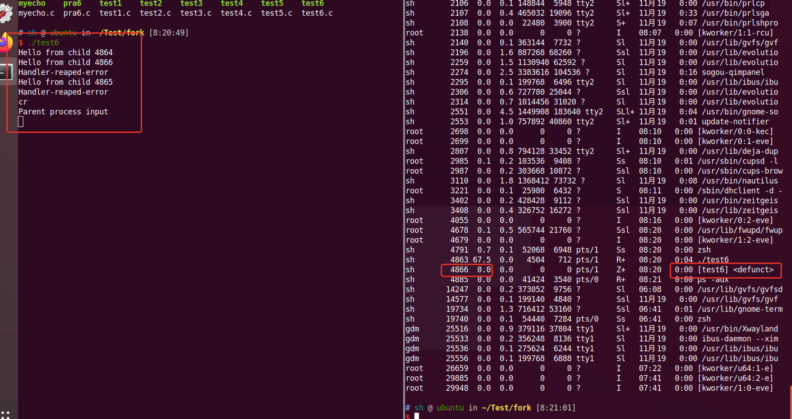

可以看到出现了僵死进程，有一个子进程没有被回收。

其原因在于代码没有解决信号不会排队等待的问题。

* 第一个`SIGCHLD`被接收进行处理，处理过程中：
  * 第二个`SIGCHLD`被阻塞，不会被接收。
  * 第三个`SIGCHLD`因为有一个`SIGCHLD`被阻塞了，所以第三个被抛弃了。

`解决方案`

在一个信号处理程序里面，尽可能多的回收子进程。

~~~c
void handler1(int sig)
{
    int olderrno = errno;
    while((waitpid(-1,NULL,0))>0)
    {
        char *buf = "Handler-reaped-error\n";
        write(1,buf,strlen(buf));
    }
    if(errno != ECHILD)
    {
        char *buf2 = "waitpid-error";
        write(1,buf2,strlen(buf2));
    }
    sleep(1);
    errno = olderrno;
}
~~~

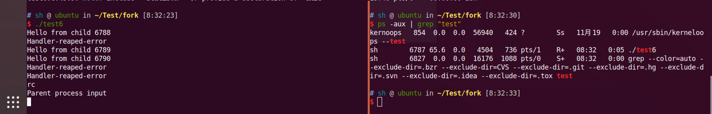

练习8.8

~~~c
#include<stdio.h>
#include<signal.h>
volatile long counter = 2;
void handle1(int sig)
{
    sigset_t mask,prev_mask;
    sigfillset(&mask);
    sigprocmask(SIG_BLOCK,&mask,&prev_mask);
    printf("%d\n",--counter);
    sigprocmask(SIG_SETMASK,&prev_mask,NULL);
    exit(0);
}
int main()
{
    pid_t pid;
    sigset_t mask,prev_mask;
    printf("%ld\n",counter);
    fflush(stdout);
    signal(SIGUSR1,handle1);
    if((pid=fork())==0)
    {
        while(1)
        {};
    }
    kill(pid,SIGUSR1);
    waitpid(-1,NULL,0);
    sigfillset(&mask);
    printf("%ld\n",mask);
    sigprocmask(SIG_BLOCK,&mask,&prev_mask);
    printf("%d\n",++counter);
    sigprocmask(SIG_SETMASK,&prev_mask,NULL);
    exit(0);
}
~~~

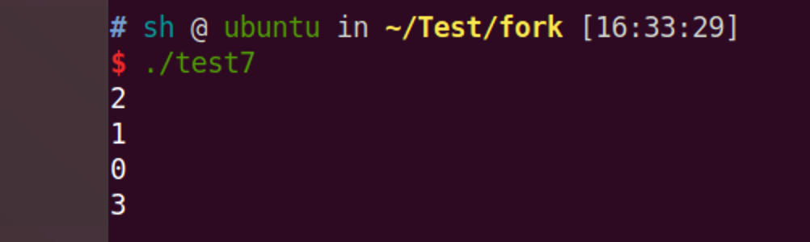

`同步流以避免讨厌的并发错误：`

~~~c
#include<signal.h>
int sigaction(int signum,struct sigaction *act,struct sigaction *oldact);//成功则返回1，失败则返回-1
~~~

## 竞争引发错误

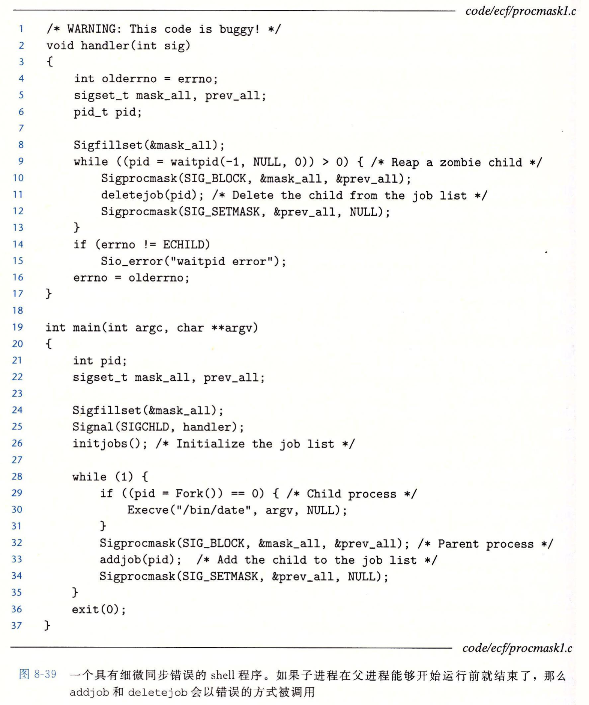

这个之前看过，当时有点蒙，现在觉得真鸡儿简单。

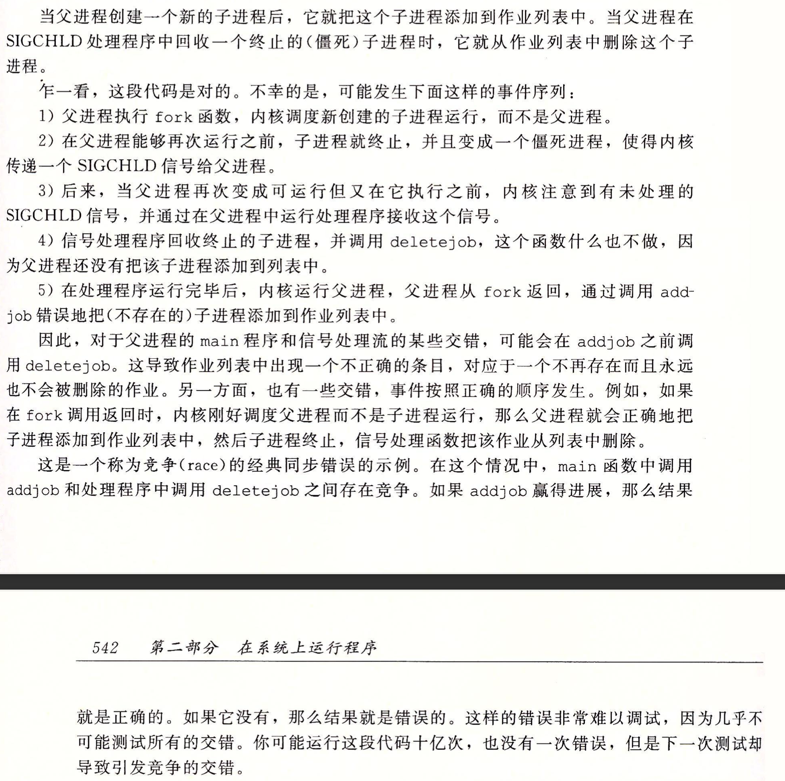

`解决方案`：

利用信号量同步进程：

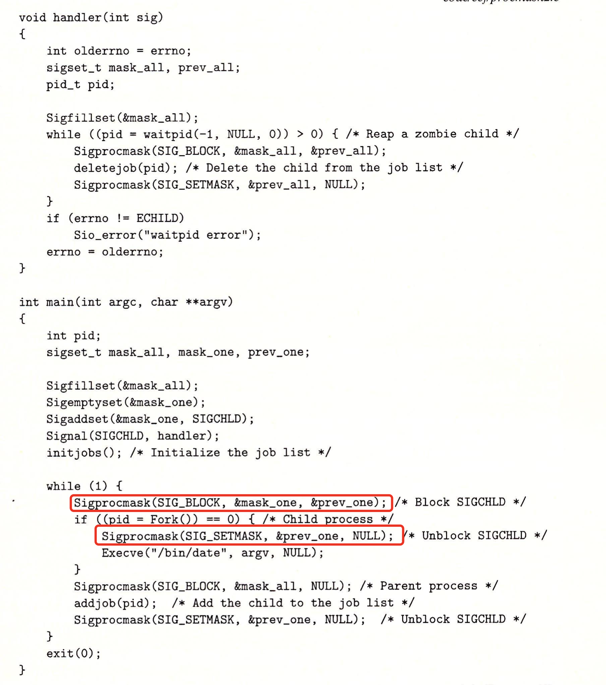

**此处防止竞争的核心思想：利用sigprocmask来同步进程，在这个例子里面，父进程保证相应的deletejob之前执行addjob,因为在fork后，父进程阻塞了内核信号，那么必然就不会执行信号处理程序deletejob，当addjob执行完之后解除阻塞，成功避免了竞争的影响。**

`显示的等待信号：`

~~~c
#include<signal.h>
int sigsuspend(const sigset_t *mask);
~~~

`sigsuspend`函数会暂时用`mask`替换当前的阻塞集合，然后挂起该进程，直到收到一个信号。行为结果：

* 运行一个处理程序。那么`sigsuspend`从处理程序返回，恢复调用`sigsuspend`时候的阻塞集合。
* 终止该进程，此时该进程不从`sigsuspend`返回就直接终止。

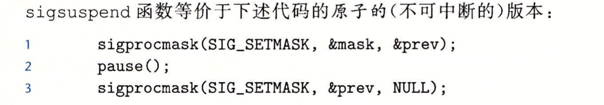

`原子属性`成功的消除了潜在的竞争。

例子：

~~~c
#include<stdio.h>
#include<signal.h>
#include<errno.h>
volatile sig_atomic_t pid;
void sigchld_handler(int s)
{
    int olderrno = errno;
    pid = waitpid(-1,NULL,0);
    errno = olderrno;
}
void sigint_handler(int s)
{

}
int main()
{
    sigset_t mask,prev;
    signal(SIGCHLD,sigchld_handler);
    signal(SIGINT,sigint_handler);
    sigemptyset(&mask);
    sigaddset(&mask,SIGCHLD);
    while(1)
    {
        sigprocmask(SIG_BLOCK,&mask,&prev);
        if((pid=fork())==0)
        {
            exit(0);
        }
        pid = 0;
        sigprocmask(SIG_SETMASK,&prev,NULL);
        while(!pid)
        {
            pause();
        }
        printf(".");
    }
    return 0;
}
~~~

**如果在while测试之后，pause测试之前收到SIGCHLD信号，pause会永远睡眠**。

这里就要说一下`pause()`的中断条件了，因为要想终止`pause`，只能是因为`SIGCHLD`信号的信号处理程序，那么上述要点就很清楚了。

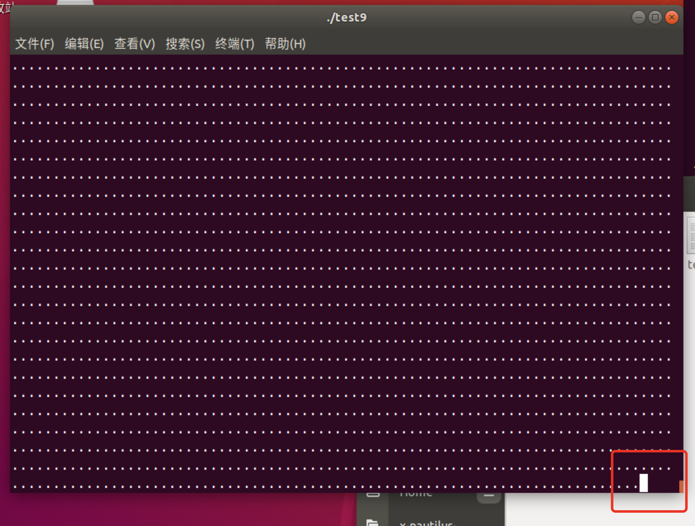

可以看到大量循环之后，程序卡死。

`使用sigsuspend`进行改进。

~~~c
#include<stdio.h>
#include<signal.h>
#include<errno.h>
volatile sig_atomic_t pid;
void sigchld_handler(int s)
{
    int olderrno = errno;
    pid = waitpid(-1,NULL,0);
    errno = olderrno;
}
void sigint_handler(int s)
{
}
int main()
{
    sigset_t mask,prev;
    signal(SIGCHLD,sigchld_handler);
    signal(SIGINT,sigint_handler);
    sigemptyset(&mask);
    sigaddset(&mask,SIGCHLD);
    while(1)
    {
        sigprocmask(SIG_BLOCK,&mask,&prev);
        if((pid=fork())==0)
        {
            exit(0);
        }
        pid = 0;
        while(!pid)
        {
            sigsuspend(&prev);
        }
        sigprocmask(SIG_SETMASK,&prev,NULL);
        printf(".");
    }
    return 0;
}
~~~

