# CSAPP第四章-处理器体系结构

指令集：

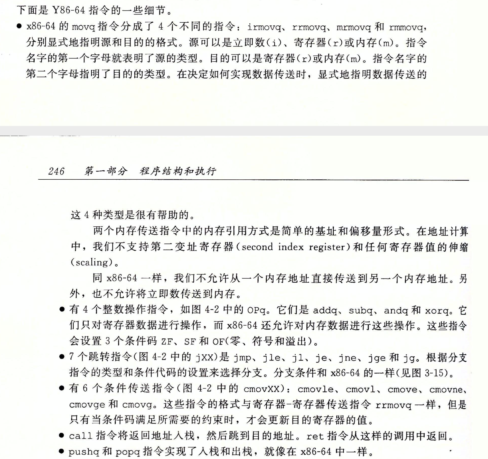

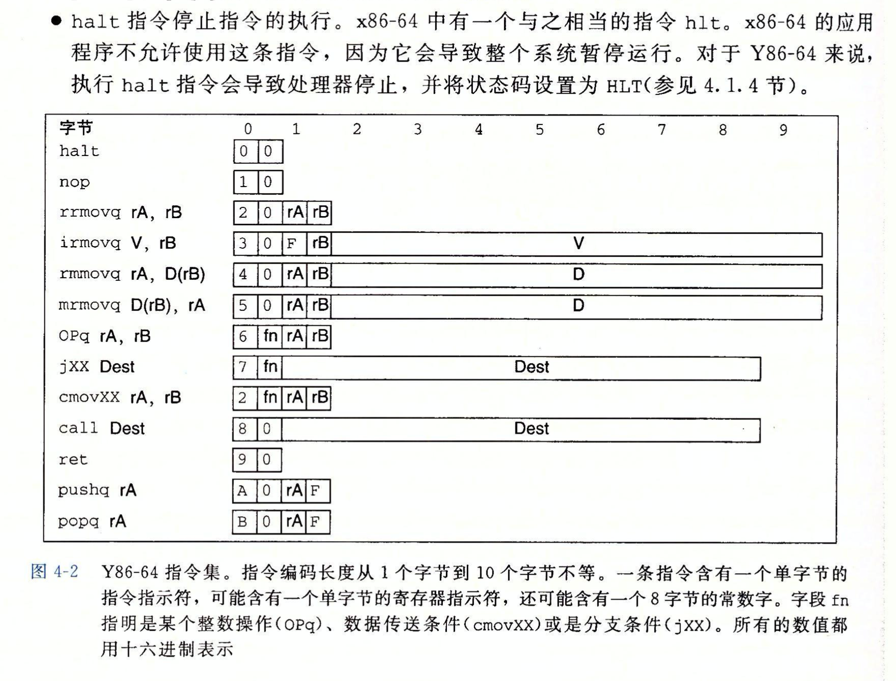

> 寄存器：程序寄存器存在cpu中的一个寄存器文件中，这个寄存器文件是一个小的，以寄存器id作为地址的随机访问存储器。
>
> 当需要指明不应访问任何寄存器的时候，就用id值0xf来表示

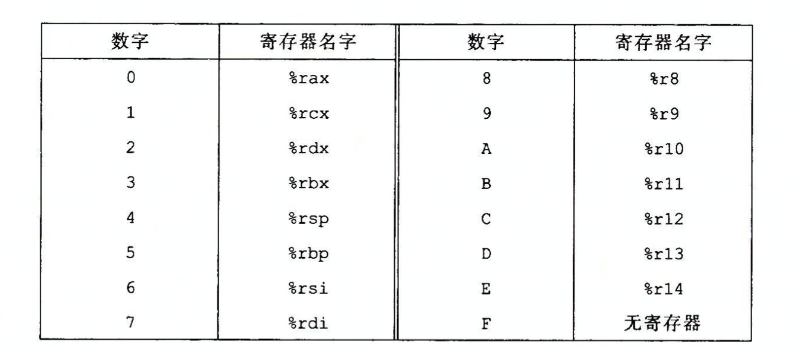

## Y84-64异常

由状态码来表示程序的可见状态：

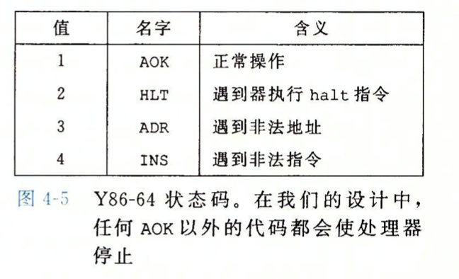

它描述程序执行的总体状态，当程序遇到异常的时候，处理器简单的停止执行指令，但是在程序的处理器中会存在**异常处理程序**。

## Y86-64程序

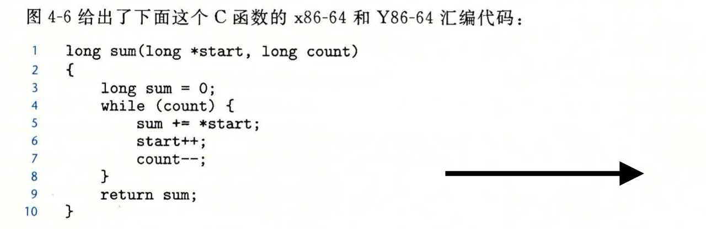

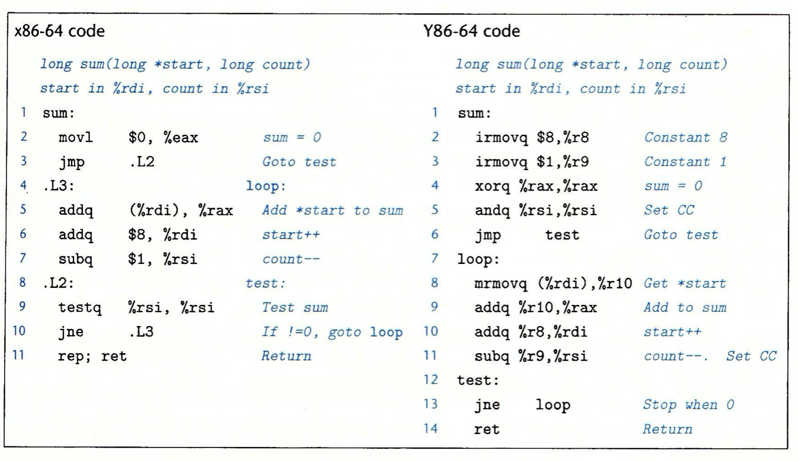

可以看出Y86-64处理器在算术指令里面不能使用立即数。

### 模板

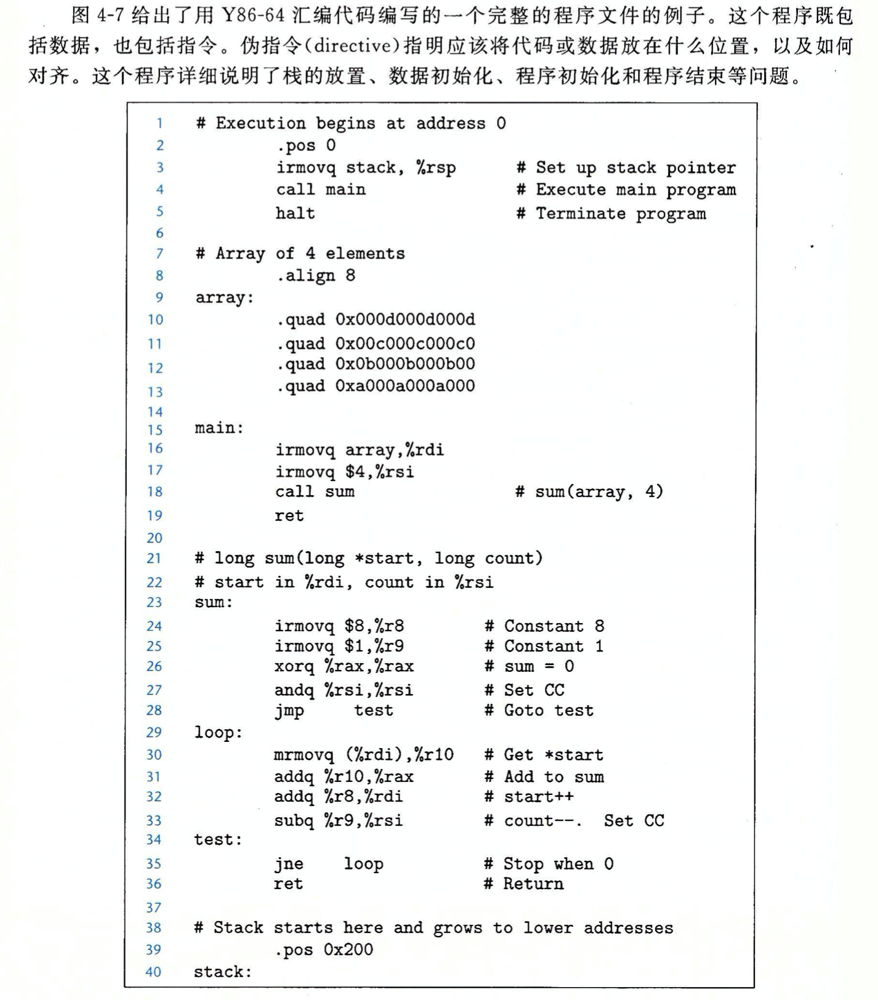

在编程Y86-64汇编程序的时候可以依赖于这个程序。

## 逻辑设计和硬件控制语言HCL

### 逻辑门

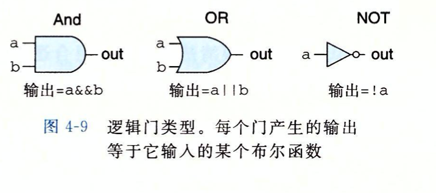

### 组合电路和HCL布尔表达式

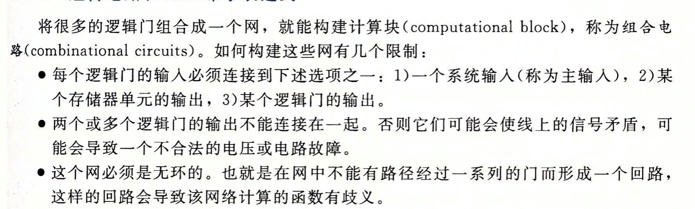

这个是一些基本的规则。

> bool eq = (a & b) || (!a && !b);

信号eq,只是一个名字，而不是跟c语言那样表示一个结果。

### 练习4.9

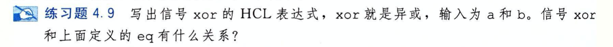

> eq = a ^ b = !((a & b) || (!a&!b))

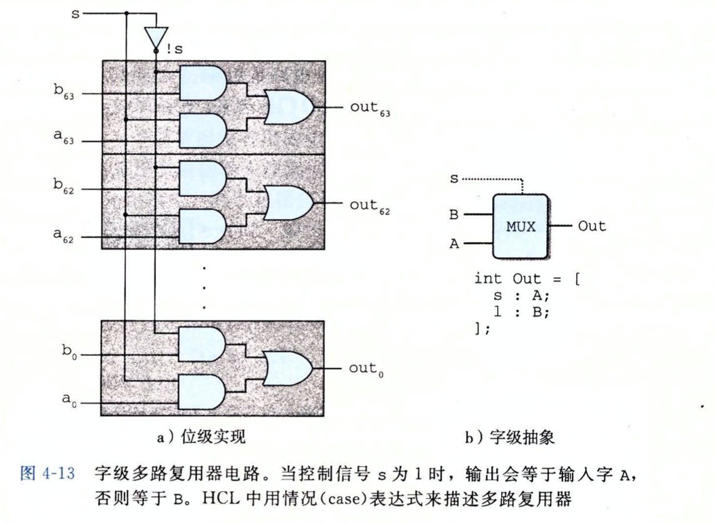

这个其实就是逐个bit的位运算来获得最终结果。

### HCL表达式

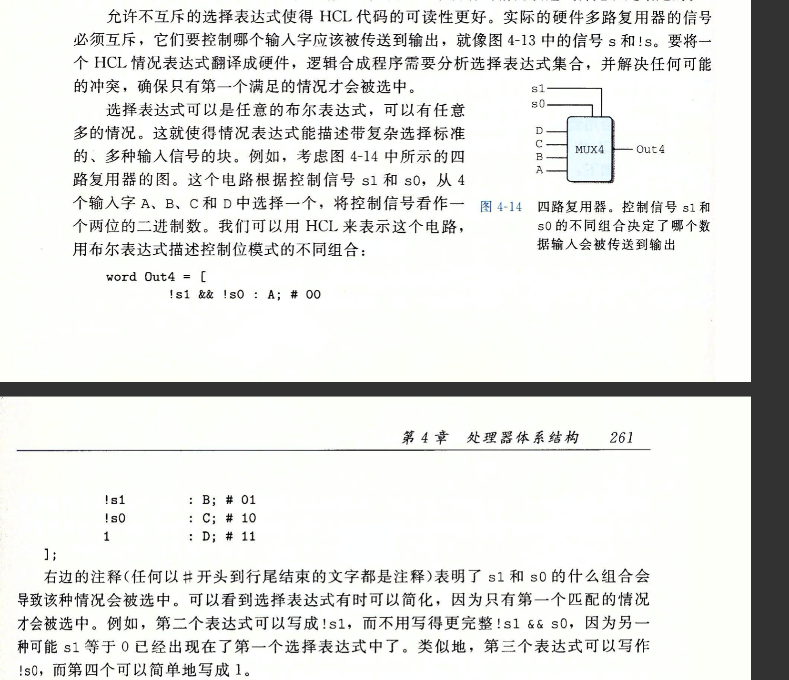

其实就是左边对应的是布尔表达式，通过结果的0和1来判断是否执行后面的表达式，但是如果一个1被遇到了，那么在表达式执行后就会终止执行。

> 改语言注释符 #

### HCL中的集合关系

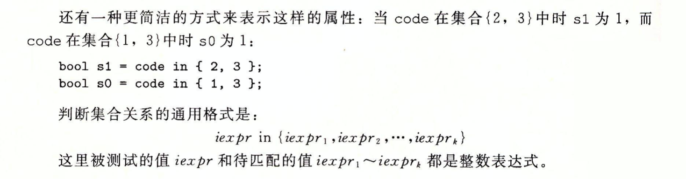

### 存储器和时钟

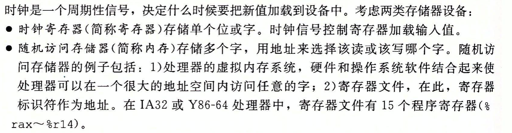

Y86-64寄存器会用时钟寄存器保存程序计数器（PC），条件代码（CC）,和程序状态（Stat）。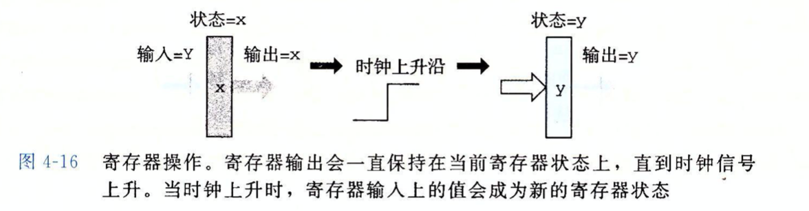

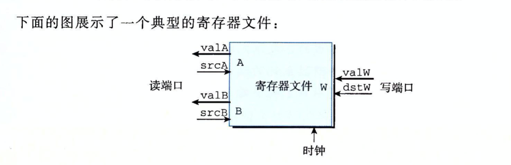

这个的意思就是一个多端口随机访问存储器允许同时进行多个读和写操作。

## 处理器操作阶段

* 取指
* 译码
* 执行
* 访存
* 写回
* 更新

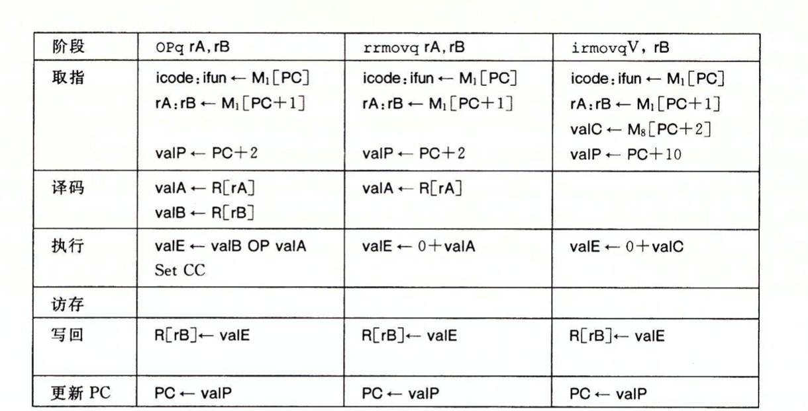

整个阶段入上，分析如下：

首先我们从pc所指向的内存里面拿出icode,然后从pc + （pc指向的以后的内存也存储这字节码），同时记录下一条指令的地址，取指完成，然后根据操作数译码，然后执行操作，然后把结构写回，更新pc执行下一条指令。

## 其余

其余的感觉。。。好像目前来说不是很重要，重点讲的是处理器的运行细节问题，所以没有重点看了。