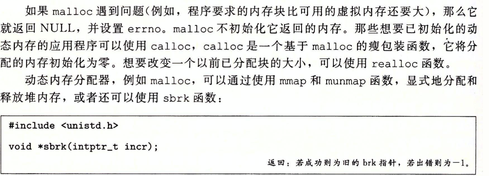
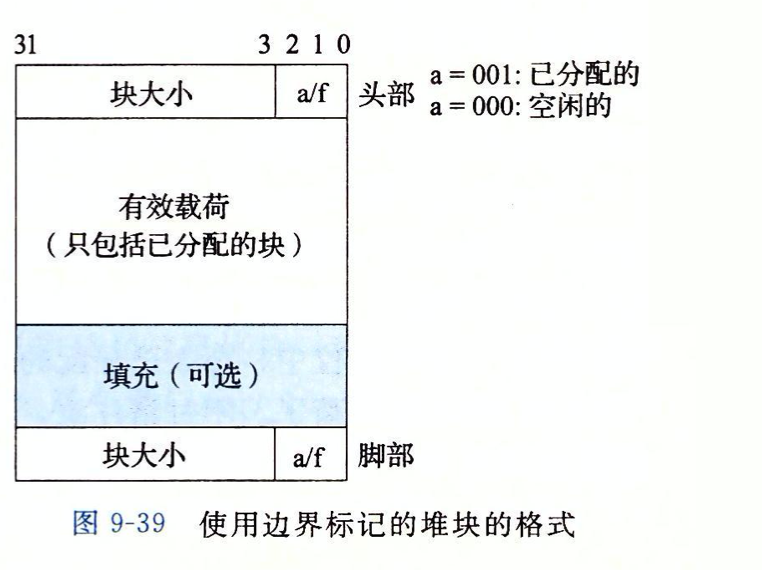
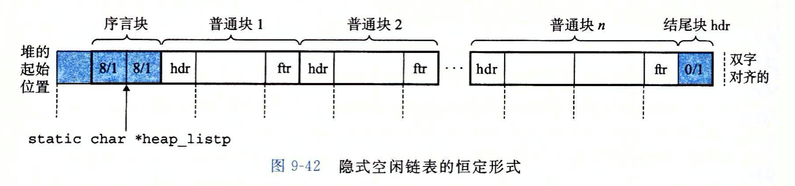
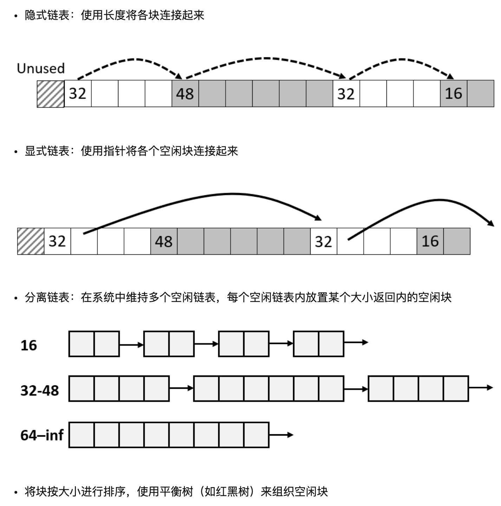

# csapp-malloc_lab

## 基础部分

> sbrk函数通过将内核brk指针增加incr来扩展和收缩堆，如果成功，它就返回brk的旧值，否则就返回-1,并将errno设置为ENOMEM.如果incr为0，那么sbrk就返回brk的当前值。用一个为负的incr来调用sbrk是合法的，而且很巧妙，因为返回值（brk的旧值）指向距新堆顶向上abs(incr)字节处。
>
> Intptr_t=long int

### 分配器的要求和目标

这是实验的块格式。

空闲链表格式：

## 实验答案

首先就是看已经给出的代码：

最开始的初始化，就是让我们通过这段区域，来实现内存管理。

~~~c
void mem_init(void)
{
    /* allocate the storage we will use to model the available VM */
    if ((mem_start_brk = (char *)malloc(MAX_HEAP)) == NULL) {
	fprintf(stderr, "mem_init_vm: malloc error\n");
	exit(1);
    }

    mem_max_addr = mem_start_brk + MAX_HEAP;  /* max legal heap address */
    mem_brk = mem_start_brk;                  /* heap is empty initially */
}
~~~

区域释放：

~~~c
void mem_deinit(void)
{
    free(mem_start_brk);
}
~~~

堆块置空

~~~c
void mem_reset_brk()
{
    mem_brk = mem_start_brk;
}
~~~

起始指针和结束指针相等，区域为空。

区域扩展：

~~~c
void *mem_sbrk(int incr) 
{
    char *old_brk = mem_brk;

    if ( (incr < 0) || ((mem_brk + incr) > mem_max_addr)) {
	errno = ENOMEM;
	fprintf(stderr, "ERROR: mem_sbrk failed. Ran out of memory...\n");
	return (void *)-1;
    }
    mem_brk += incr;
    return (void *)old_brk;
}
~~~

> 这里返回的old_brk其实还是那个地址，但是通过那个mem_brk += incr可以知道，区域大小已经扩展了。

其他的都很普通了，不过有一个很重要：

~~~c
/*
 * mem_pagesize() - returns the page size of the system
 */
size_t mem_pagesize()
{
    return (size_t)getpagesize();
}
~~~

返回页大小。

Mm.h

~~~c
#include <stdio.h>

extern int mm_init (void);
extern void *mm_malloc (size_t size);
extern void mm_free (void *ptr);
extern void *mm_realloc(void *ptr, size_t size);

/* 
 * Students work in teams of one or two.  Teams enter their team name, 
 * personal names and login IDs in a struct of this
 * type in their bits.c file.
 */
typedef struct {
    char *teamname; /* ID1+ID2 or ID1 */
    char *name1;    /* full name of first member */
    char *id1;      /* login ID of first member */
    char *name2;    /* full name of second member (if any) */
    char *id2;      /* login ID of second member */
} team_t;

extern team_t team;
~~~

这个就是定义了一些函数和数据结构，其实这个结构体没卵用，作者装逼专用（玩笑话）。

define

:

~~~c
#define ALIGNMENT 8

/* rounds up to the nearest multiple of ALIGNMENT */
#define ALIGN(size) (((size) + (ALIGNMENT-1)) & ~0x7)

#define SIZE_T_SIZE (ALIGN(sizeof(size_t)))
#define WSIZE    4
#define DSIZE    8
#define CHUNKSIZE (1<<12) // 4096
#define MAX(x,y)  ((x) > (y)?(x):(y))

#define PACK(size, alloc) ((size) | (alloc)) //与操作

#define GET(p)  (*(unsigned int *)(p)) //指针执行的内容
#define PUT(p, val) (*(unsigned int *)(p) = (val)) //指针指向的地方进行赋值

#define GET_SIZE(p)  (GET(p) & ~0x7) //除去低位获得堆块大小
#define GET_ALLOC(p) (GET(p) & 0x1) //获得分配标志位

#define HDRP(bp)  ((char *)(bp) - WSIZE) //指针上移4字节
#define FTRP(bp)  ((char *)(bp) + GET_SIZE(HDRP(bp)) - DSIZE) //加上堆块size然后减去DSIZE

#define NEXT_BLKP(bp)   ((char *)(bp) + GET_SIZE(((char *)(bp) - WSIZE))) //下寻
#define PREV_BLKP(bp)   ((char *)(bp) - GET_SIZE(((char *)(bp) - DSIZE))) //上寻
~~~

~~~c
int mm_init(void)
{
    if((heap_listp = mem_sbrk(4 * WSIZE)) == (void *)-1) return -1;
    PUT(heap_listp,0); //堆的起始位置，
    PUT(heap_listp + (1*WSIZE),PACK(DSIZE,1));
    PUT(heap_listp + (2*WSIZE),PACK(DSIZE,1));
    PUT(heap_listp + (3*WSIZE),PACK(0,1));
    heap_listp += (2*WSIZE);
    if(extend_heap(CHUNKSIZE/WSIZE) == NULL) return -1;
    return 0;
}
~~~

其实就是这个图片。

堆扩展：

~~~c
static void *extend_heap(size_t words)
{
    char *bp;
    size_t size;
    size = (words % 2)?(words+1)*WSIZE:WSIZE; //确定size，8的倍数
    if((long)(bp = mem_sbrk(size)) == -1) return NULL;
    PUT(HDRP(bp), PACK(size, 0));//这里就是设置新的堆头
    PUT(FTRP(bp), PACK(size, 0));
    PUT(HDRP(NEXT_BLKP(bp)), PACK(0, 1)); //结尾
    return bp;
}
~~~

~~~c
void *mm_malloc(size_t size)
{
    size_t asize;
    size_t extendsize;
    char *bp;

    if(size == 0)  return  NULL;

    if(size <= DSIZE) asize  = 2 * DSIZE; //最低Sieze
    else asize = DSIZE * ((size + (DSIZE) + (DSIZE - 1))/DSIZE); //成chunk倍数

    if((bp = best_fit(asize)) != NULL){
        place(bp, asize);
        return bp;
    }

    //immediate or delay
    delay_coalesce();
    if((bp = best_fit(asize)) != NULL){
        place(bp, asize);
        return bp;
    }

    extendsize = MAX(asize, CHUNKSIZE);
    if((bp = extend_heap(extendsize/WSIZE)) == NULL) return NULL;
    place(bp, asize);
    return bp;
}
~~~

> 这个是malloc的核心函数

堆块的free操作：

~~~c
void mm_free(void *ptr)
{
    if(ptr == NULL) return;
    size_t size = GET_SIZE(HDRP(ptr));

    PUT(HDRP(ptr), PACK(size, 0));
    PUT(FTRP(ptr), PACK(size, 0));
    //immediate_coalesce(ptr);
    //immediate or delay
}
~~~

这个就很简单了，指针置空，标志位置0就可以了

堆块的分配：

~~~c
void *mm_malloc(size_t size)
{
    size_t asize;
    size_t extendsize;
    char *bp;

    if(size == 0)  return  NULL;

    if(size <= DSIZE) asize  = 2 * DSIZE;
    else asize = DSIZE * ((size + (DSIZE) + (DSIZE - 1))/DSIZE); //size确定

    if((bp = best_fit(asize)) != NULL){ //搜索空闲链表
        place(bp, asize);
        return bp;
    }

    //immediate or delay
    delay_coalesce();
    if((bp = best_fit(asize)) != NULL){
        place(bp, asize);
        return bp;
    }

    extendsize = MAX(asize, CHUNKSIZE);
    if((bp = extend_heap(extendsize/WSIZE)) == NULL) return NULL; //找不到合适堆块就进行扩展
    place(bp, asize);
    return bp;
}
~~~

废弃堆块的合并

~~~c
static void *immediate_coalesce(void *bp){
    size_t prev_alloc = GET_ALLOC(FTRP(PREV_BLKP(bp)));
    size_t next_alloc = GET_ALLOC(HDRP(NEXT_BLKP(bp)));
    size_t size = GET_SIZE(HDRP(bp));

    if(prev_alloc && next_alloc) return bp;
    else if(prev_alloc && !next_alloc){
        size += GET_SIZE(HDRP(NEXT_BLKP(bp)));
        PUT(HDRP(bp), PACK(size, 0));
        PUT(FTRP(bp), PACK(size, 0));
    }
    else if(!prev_alloc && next_alloc){
        size += GET_SIZE(HDRP(PREV_BLKP(bp)));
        PUT(FTRP(bp), PACK(size, 0));
        PUT(HDRP(PREV_BLKP(bp)), PACK(size, 0));
        bp = PREV_BLKP(bp);
    }
    else{
        size += GET_SIZE(HDRP(PREV_BLKP(bp))) + GET_SIZE(FTRP(NEXT_BLKP(bp)));
        PUT(HDRP(PREV_BLKP(bp)), PACK(size, 0));
        PUT(FTRP(NEXT_BLKP(bp)), PACK(size, 0));
        bp = PREV_BLKP(bp);
    }
    return bp;
}
~~~

> 其实大致就这么多了，比起malloc的源码，还是简单不少。

## 追踪堆块的四种方法

