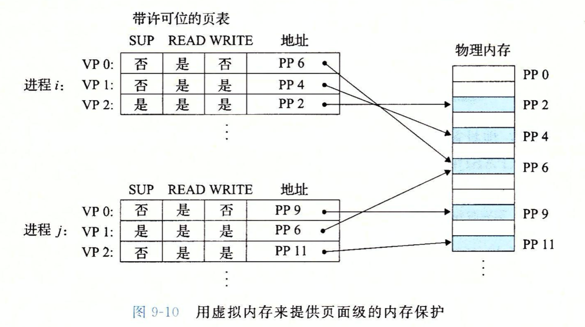
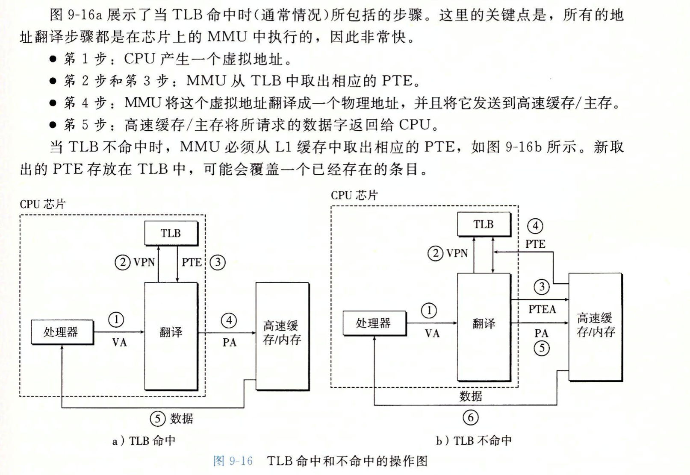
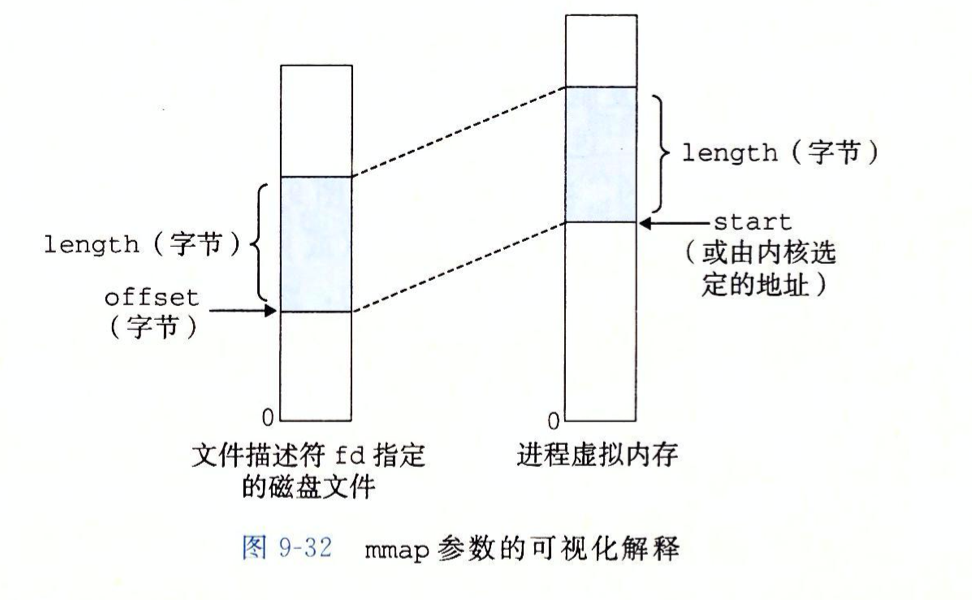

# csapp-第九章-虚拟内存

## 物理地址和虚拟地址

> 内存管理单元MMU来实现虚拟地址到物理地址的转换。

## DRAM缓存的组织结构

SRAM来表示cpu和主存之间的L1,L2,L3高速缓存，并且术语DRAM缓存表示虚拟内存系统的缓存。

### 虚拟内存系统

VM系统通过把虚拟内存分割成称为虚拟页的大小固定的块来解决缓存问题

### 页表

页表就是一个页表条目（PTE）的数组。虚拟地址空间的每个页在页表中一个固定偏移处都有一个PTE。

### 缺页

DRAM缓存不命中的话就叫做缺页，这会引发缺页异常，进而调用内核中的缺页异常处理程序。

流程如下：

* 在DRAM中选择一个牺牲页，将其复制回磁盘。
* 内核从磁盘里复制相应页到内存中的页表。

> 当异常处理程序结束的时候，它会重新启动导致缺页的指令。

缺页前：

缺页处理后：

### 其带来的优势

## 虚拟内存作为内存保护的工具

通过在PTE(页表项)添加一些标志位就会使得控制对一个虚拟页面的内容的访问十分简单：

> 大致思想，实际上要更麻烦亿点点

* Sup 表示进程是否运行在内核模式下才能访问该页
* READ和WRITE就是标识读写

> 违反这些就会引发段错误

### 地址翻译

### 结构高速缓存和虚拟内存

> 这个就比较接近实际情况了

### TLB（快表）

TLB是虚拟寻址的缓存，其实就是把常用的PTE放在了里面。

### 多级页表

> ucore里面其实有很多描述了，就不重复 写了

### 总结一波

前提：

虚拟地址和物理地址的格式：

这这个内存系统里面，每个页是2的6次方=64字节，所以低6位作为VPO和PPO虚拟地址高8位作为VPN。

* MMU从虚拟地址中抽取VPN,检查TLB,看其是否存在
* TLB从VPN中抽取TLB索引0x03和TLB标记0x3
* 
* 组0x3的第二个条目中有效匹配，所以命中，然后将缓存的PPN返回给MMU（有点困惑，不过猜测应该是组相联映射寻址）
* 如果上一步没有命中的话，就要从主存里面找出相应的PTE.
* MMU通过来自PTE的PPN和来自虚拟地址的VPO,就形成了物理地址。

## Intel Core i7/Linux 内存系统（重点）

* CR3控制寄存器指向第一级页表（L1）的起始位置，其值是每个进程上下文的一部分，每次上下文切换的时候CR3的值都会被恢复。

i7封装：

i7地址翻译：

从这里就看出了TLBT和TLBI的作用了，组相联映射找到对应的块。

P=1（LInux里面总是如此），地址字段就包含一个40位的物理页号PPN，它指向适当的页表的开始处。

> 这强加了一个要求，要求物理页表4kb对齐，低12位1Kb

第一级，第二级，第三级页表中的条目的格式：

第四级（最后一级）页表中条目的格式。

PTE通过权限位可以很好的控制对页的访问。

但是在MMU替换页的时候，我们可以想到，替换下来的页可能还是有用的呢，这就又用到了标志位。

> 当MMU翻译一个虚拟地址的时候，它会更新另外两个内核缺页处理程序会用到的位。所以，当每次访问一个页的时候，MMU都会设置A位，内核可以用这个引用位来实现它的页替换算法。每次都一个页进行了写之后，MMU都会设置D位，又称为修改位或者脏位，它告诉内核在复制替换页之前是否必须写回牺牲页，内核可以通过一条特殊的内核模式指令来清除引用位或者修改位。

## 虚拟内存系统（重点）

> 因为是pwn手，很了解，所以就是简述了。

### Linux虚拟内存区域

内核为系统中的每个进程维护一个单独的任务结构（task_struct）.

> 任务结构包含或者指向内核运行该进程所需要的所有信息。

* mm_struct描述了虚拟内存的当前状态。
* pgd指向第一级页表的基址
* mmap指向一个vm_area_structs的链表
* Vm_area_Structs描述了当前虚拟地址空间的一个区域。

> 当内核运行进程的时候将pgd放入CR3

* vm_start: 指向这个区域的起始处
* Vm_end: 指向这个区域的结束处
* Vm_prot : 描述这个区域内包含的所有页的读写许可权限
* Vm_flags: 描述这个区域内的页面是与其他进程共享的，还是这个进程私有的。
* Vm_next: 指向链表中下一个区域结构。

### Linux缺页异常处理

### 内存映射

> 感觉学过好多次了，当做复习吧 emmmm

Linux文件系统中的普通文件：

​	就普通的映射呗。

匿名文件：

​	一个区域可以映射到一个匿名文件，匿名文件由内核创建，包含的全是二进制0。

### 共享对象

一个对象可以被映射到虚拟内存的一个区域，要么作为共享对象，要么作为私有对象，如果一个进程将一个共享对象映射到他的虚拟地址的一个区域，那么它对这个区域的操作对其他进程可见，同时可以反映到磁盘上，但是如果映射到了私有区域，那么其他进程不可见，而且不会在磁盘上发生变化。

共享对象在虚拟区域：

私有区域的写时复制：

可以看到在读时，其实用的还是同一个物理页面，但是在发生写入的时候就会进行复制，使得其不会影响其他进程。

### fork函数（重点）

其实就是写时复制。

### execve("a.out",NULL,NULL) （重点）

感觉就是用新的进程替代了当前进程，当前进程的其余代码就不会执行了，有点秀奥。

### mmap函数的用户级内存映射

函数

~~~c
#include<unistd.h>
#include<sys/mman.h>
void *mmap(void *start, size_t length,int prot,int flags,int fd,off_t offset);
~~~

文件映射到虚拟内存。

参数含义：

* prot包含新映射的虚拟内存区域的访问权限位，（相应区域结构中的vm_prot位）。
  * PROT_EXEC:这个区域可以被cpu执行的指令组成。
  * PROT_READ,区域内页面可读
  * PROT_READ,可写
  * PROT_NONE：不可被访问。
* Flag由被描述的映射对象类型的位组成。如果设置了MAP_ANON标记位那么被映射的对象就是一个匿名对象，而相应的虚拟页面是请求二进制零的。MAP_PRIVATE表示被映射的对象是一个私有的，写时复制的对象，而MAP_SHARED表示是一个共享对象。
  * 例子：bufp = Mmap(NULL,size,PROT_READ,MAP_PRIVATE|MAP_ANON,0,0);
    * 创建一个新的包含size字节的只读，私有，请求二进制零的虚拟内存区域。

### munmap

~~~c
#include<unistd.h>
#include<sys/mman.h>
int munmap(void *start, size_t length)
~~~

删除虚拟内存的区域，接下来对已删除的段进行引用会引发段错误。

> 基础知识就这么多了，下面就进入了实验部分。