#  系统级IO

## Unix I/O

下面是linux的目录结构：

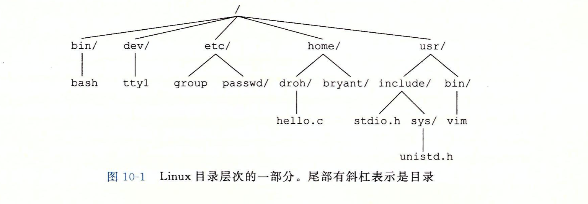

输入输出操作都以统一一致的方式来执行：

* 打开文件。内核会返回一个小的非负整数，叫做描述符，它来标识这个文件，内核会记录有关文件的所有信息，应用程序只需要记住这个描述符。
* Linux Shell 创建进程的时候都会打开3个文件:0,1,2.其中头文件`<unistd.h>`定义了常量STDIN_FILENO,STDOUT_FILENO,STDERR_FILENO.代替显式的描述符常量。
* 改变当前文件位置：每个打开的文件，内核保持一个文件位置k,初始为0，改值是相对于文件起始的偏移，应用程序可以通过seek操作，显示的设置当前位置为k
* 读写文件：文件复制n>0个字节到内存，从k位置开始，然后k增加到k+n。假如一个大小为m字节的文件，当k>=m的时候，会触发EOF(end-of-file)，应用程序能够检测到这个条件。但是文件结尾没有明确的"EOF符号"。
* 关闭文件：当完成文件访问之后，它通知内核关闭这个文件。内核释放文件打开时创建的数据结构，并将描述符恢复到可用的描述符池中。无论一个进程因为何种原因终止，内核都会关闭所有打开的文件并释放它的内存资源。

## 文件

* 普通文件：ASCII,Unicod，binary文件
* 目录：这是包含一组`链接`的文件，其中每个链接都将一个文件名映射到一个文件，其最少包含两个链接`.和..`分别代表当前和父目录。
* 套接字，用来与另一个进程进行跨网络通信的文件。

还有其他的文件类型不太讨论范围。

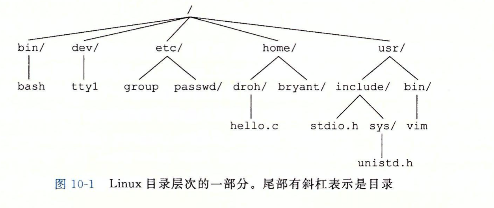

文件打开和关闭：

~~~c
int open("filename",int flags,mode_t mode);
~~~

每个进程都有一个`umask`，它通过`umask`函数设置，`open`用来`创建文件`的时候如果含有`mode`参数的话，访问权限被设置为`mode &~ umask`，这样我们就发现，如果为0的话，其实权限为当前用户对该文件的权限。

解释一下`umask`

> umask值用于设置用户在创建文件时的默认权限，当我们在系统中创建目录或文件时，目录或文件所具有的默认权限就是由umask值决定的。对于文件，默认权限来自于777-umask得到的值
>
> 系统默认的掩码是0022。

旁注：

* linux里面`size_t`=`unsigned int` 但是 `ssize_t`=`long`，read的返回值是`ssize_t`类型的。

## RIO包实现健壮读写

> Rio包即为Robust io函数包。包中函数是对Linux基本I/O函数的封装

RIO提供两类不同的函数：

* 无缓冲区的输入输出函数。一般应用于网络。

  * ~~~c
    ssize_t rio_readn(int fd,void *usrbuf, size_t n);
    ssize_t rio_writen(int fd,void *usrbuf,size_t n);
    ~~~

  * ~~~c
    ssize_t rio_readn(int fd, void *usrbuf, size_t n) 
    {
        size_t nleft = n; //剩下未读字符数
        ssize_t nread;
        char *bufp = usrbuf;
    
        while (nleft > 0) {
    	if ((nread = read(fd, bufp, nleft)) < 0) {
            if (errno == EINTR)  //被信号处理函数中断
    		nread = 0;      //本次读到0个字符，再次读取
    	    else
    		return -1;      //出错，errno由read设置
        } 
    	else if (nread == 0) //读取到EOF
            break;              
        nleft -= nread; //剩下的字符数减去本次读到的字符数
    	bufp += nread;  //缓冲区指针向右移动
        }
        //返回实际读取的字符数
        return (n - nleft);         /* return >= 0 */
    }
    ssize_t rio_writen(int fd, void *usrbuf, size_t n)  //其原理和read类似
    {
        size_t nleft = n;
        ssize_t nwritten;
        char *bufp = usrbuf;
    
        while (nleft > 0) {
    	if ((nwritten = write(fd, bufp, nleft)) <= 0) {
    	    if (errno == EINTR)  
    		nwritten = 0;    
    	    else
    		return -1;       
    	}
    	nleft -= nwritten;
    	bufp += nwritten;
        }
        return n;
    }
    ~~~

* 带缓冲区的输入函数。一般应用于应用,这其实避免了每次读取都要求陷入内核，大大减小了开销，但是可能不会及时传输。

  * ~~~c
    void rio_readinitb(rio_t *rp,int fd); //将描述符fd和地址rp处的一个类型为rio_t的读缓冲区联系起来。
    ssize_t rio_readline(rio_t *rp,void *usrbuf,size_t n);
    ssize_t rio_readnb(rio_t *rp,void *usrbuf,size_t n);
    ~~~
    
  * ~~~c
    typedef struct {
        int rio_fd;                //与内部缓冲区关联的描述符
        int rio_cnt;               //缓冲区中剩下的字节数
        char *rio_bufptr;          //指向缓冲区中下一个未读的字节
        char rio_buf[RIO_BUFSIZE]; 
    } rio_t;
    ~~~
  
  * ~~~c
    void rio_readinitb(rio_t *rp, int fd) 
    {
        rp->rio_fd = fd;  
        rp->rio_cnt = 0;  
        rp->rio_bufptr = rp->rio_buf;
    }
    static ssize_t rio_read(rio_t *rp, char *usrbuf, size_t n)
    {
        int cnt;
        while (rp->rio_cnt <= 0) {  //缓冲区为空，调用read填充
    	rp->rio_cnt = read(rp->rio_fd, rp->rio_buf, 
    			   sizeof(rp->rio_buf));
    	if (rp->rio_cnt < 0) {
    	    if (errno != EINTR) /* Interrupted by sig handler return */
    		return -1;
    	}
    	else if (rp->rio_cnt == 0)  /* EOF */
    	    return 0;
    	else 
    	    rp->rio_bufptr = rp->rio_buf; /* Reset buffer ptr */
        }
    
        /* Copy min(n, rp->rio_cnt) bytes from internal buf to user buf */
        cnt = n;          
        if (rp->rio_cnt < n)   
    	cnt = rp->rio_cnt;
        memcpy(usrbuf, rp->rio_bufptr, cnt);
        rp->rio_bufptr += cnt;
        rp->rio_cnt -= cnt;
        return cnt;
    }
    ssize_t rio_readnb(rio_t *rp, void *usrbuf, size_t n) //这个其实就是利用rio_read来实现特定字节数量的读取
    {
        size_t nleft = n;
        ssize_t nread;
        char *bufp = usrbuf;
        
        while (nleft > 0) {
    	if ((nread = rio_read(rp, bufp, nleft)) < 0) 
                return -1;          /* errno set by read() */ 
    	else if (nread == 0)
    	    break;              /* EOF */
    	nleft -= nread;
    	bufp += nread;
        }
        return (n - nleft);         /* return >= 0 */
    }
    ssize_t rio_readlineb(rio_t *rp, void *usrbuf, size_t maxlen)  //这个无非是遇到换行就跳转结束。
    {
        int n, rc;
        char c, *bufp = usrbuf;
    
        for (n = 1; n < maxlen; n++) { 
            if ((rc = rio_read(rp, &c, 1)) == 1) {
    	    *bufp++ = c;
    	    if (c == '\n') {
                    n++;
         		break;
                }
    	} else if (rc == 0) {
    	    if (n == 1)
    		return 0; //第一次读取就到了EOF
    	    else
    		break;    //读了一些数据后遇到EOF
    	} else
    	    return -1;	  /* Error */
        }
        *bufp = 0;
        return n-1;
    }
    ~~~
  
  * 每打开一个描述符，都会调用`rio_readinitb`函数，这其实是为了设置结构体数据。
  
  ## 读取文件元数据
  
  ~~~c
  #include<unistd.h>
  #include<sys/stat.h>
  int stat(const char *filename,struct stat *buf);
  int fstat(int fd,struct stat *buf);
  ~~~
  
  ~~~c
  struct stat {
      dev_t         st_dev;       //文件的设备编号
      ino_t         st_ino;       //节点
      mode_t        st_mode;      //文件的类型和存取的权限
      nlink_t       st_nlink;     //连到该文件的硬连接数目，刚建立的文件值为1
      uid_t         st_uid;       //用户ID
      gid_t         st_gid;       //组ID
      dev_t         st_rdev;      //(设备类型)若此文件为设备文件，则为其设备编号
      off_t         st_size;      //文件字节数(文件大小)
      unsigned long st_blksize;   //块大小(文件系统的I/O 缓冲区大小)
      unsigned long st_blocks;    //块数
      time_t        st_atime;     //最后一次访问时间
      time_t        st_mtime;     //最后一次修改时间
      time_t        st_ctime;     //最后一次改变时间(指属性)
  };
  ~~~
  
  ~~~c
  #include <sys/stat.h>
  #include <unistd.h>
  #include<stdio.h>
  int main(int argc,char **argv)
  {
      struct stat stat1;
      char *type, *readok;
      stat(argv[1],&stat1);
      if(S_ISREG(stat1.st_mode)) //普通文件
      {
          type = "regular";
      }
      else if(S_ISDIR(stat1.st_mode)) //目录文件
      {
          type = "directory";
      }
      else{
          type = "ohter";
      } //S_ISSOCK(stat1.st_mode)判断套接字
      if(stat1.st_mode & S_IRUSR) 
      {
          readok = "ok";
      }
      else{
          readok = "no";
      }
      printf("type %s, read --> %s\n",type,readok);
      return 0;
  }
  ~~~
  
  ## 读取目录内容
  
  ~~~c
  #include<sys/types.h>
  #include<dirent.h>
  DIR *opendir(const char *name);
  ~~~
  
  返回值是指向目录流(directory stream)的指针。
  
  ~~~c
  #include<dirent.h>
  struct dirent *readdir(DIR *dirp);
  ~~~
  
  返回值是指向流`dirp`里面下一个目录项的指针，如果没有更多，那么就返回NULL，并设置errno,唯一可以区分错误和流结束的情况的方法是检查自调用`readdir`以来，errno是否被修改过。
  
  ~~~c
  struct dirent{
  	ino_t d_ino; //inode number,文件位置
  	char d_name[256]; //filename
  }
  ~~~
  
  ~~~c
  #include<dirent.h>
  int closedir(DIR *dirp)
  ~~~
  
  ## 共享文件
  
  内核用三个相关的数据结构来表示打开的文件：
  
  * 描述符：每个进程都有自己的描述符表，表项是由进程打开的文件描述符来索引的，每个打开的描述符表项指向文件表中的一个表项。
  * 文件表：打开文件的集合，所有进程共享这个表。其表项包括：
    * 当前文件位置
    * 引用计数（当前指向的改表项的描述符表项个数），当引用计数为0的时候内核才会删除改表项。
    * 指向`v-node`表中对应表项的指针。
    * 等等
  * v-node表：所有进程共享，其包含`stat`结构中的大多数信息，包括`st_mode`和`st_size`成员。
  
  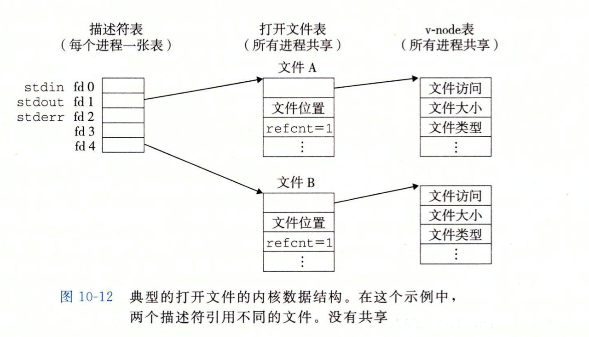
  
  共享一个文件：
  
  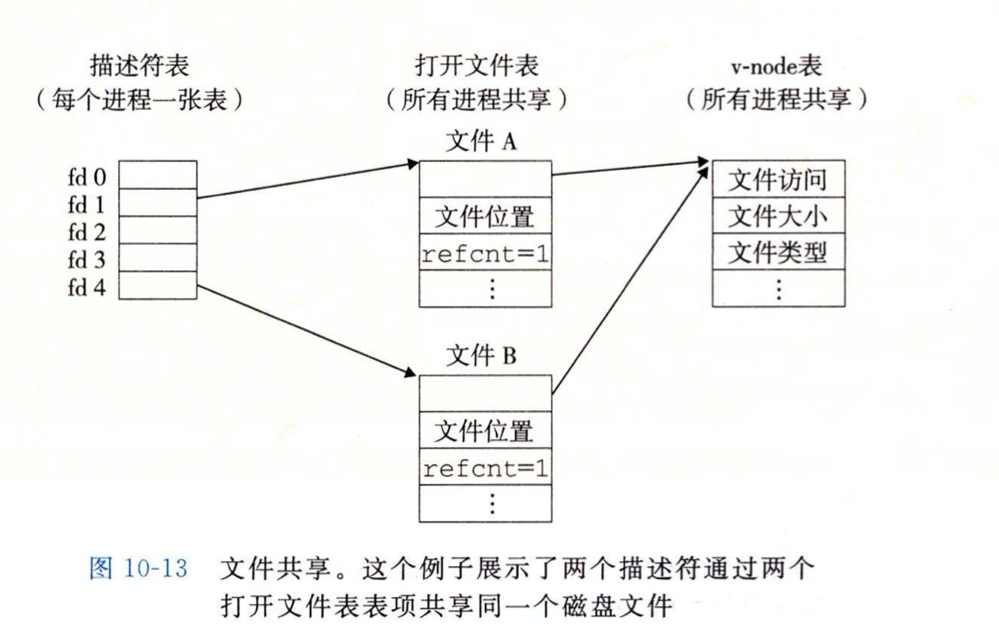
  
  父子进程共享（因为子进程也会继承父进程打开的文件）：
  
  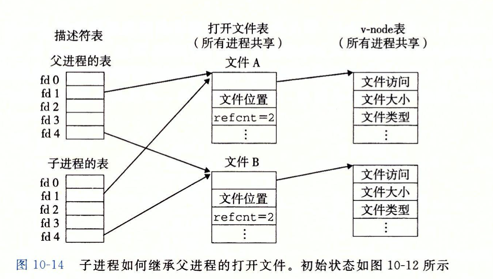

### TEST

~~~c
#include<stdio.h>
#include<sys/types.h>
#include<sys/stat.h>
#include<fcntl.h>
int main()
{
    int fd1,fd2;
    char c;
    fd1 = open("a",O_RDONLY,0);
    fd2 = open("a",O_RDONLY,0);
    read(fd1,&c,1);
    read(fd2,&c,1);
    printf("c = %c\n",c);
    return 0;
}
~~~

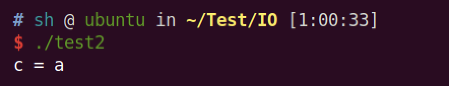

文件a的内容"asdadasdasdad"

所以，可以证明这是文件描述符表里面的两个表项。

~~~c
#include<stdio.h>
#include<sys/types.h>
#include<sys/stat.h>
#include<fcntl.h>
int main()
{
    int fd1;
    char c;
    fd1 = open("a",O_RDONLY,0);
    if(fork()==0)
    {
        read(fd1,&c,1);
        exit(0);
    }
    wait(NULL);
    read(fd1,&c,1);
    printf("c = %c\n",c);
    return 0;
}
~~~

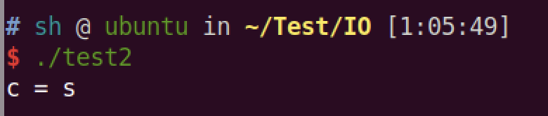

可以看出子进程里面的文件描述符表就是父进程的副本，进而交叉产生影响。

## IO重定向

~~~c
#include<unistd.h>
int dup2(int oldfd,int newfd);
~~~

这个函数被用来实现重定向操作，其将赋值描述符表项`oldfd`到描述符表表项`newfd`，覆盖`newfd`以前的内容，如果`newfd`已经打开，`dup2`会复制`oldfd`之前关闭`newfd`。

`dup2(4,1)`执行前：

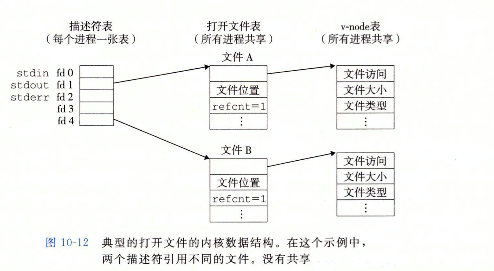

* A（stdout）,B引用计数都为1

`dup2(4,1)`执行后：

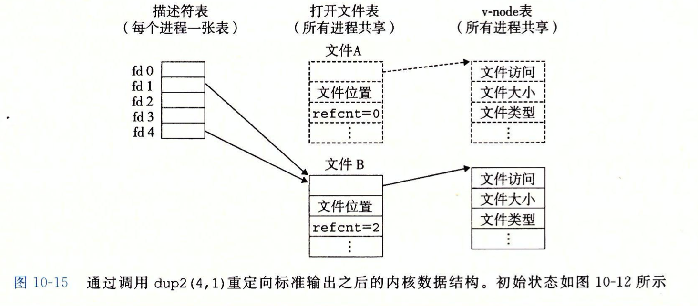

* A被关闭，它的文件表和`v-node`都关闭了。
* 文件B的引用计数增加，

结果：任何的标准输出都被重定向到文件`B`;

注意：`newfd`被关闭，`oldfd`被赋值为`newfd`的值。

~~~C
#include<stdio.h>
#include<unistd.h>
#include<sys/types.h>
#include<sys/stat.h>
#include<fcntl.h>
int main()
{
    int fd = open("a",O_RDWR,0);
    dup2(3,1);
    printf("hello world");
    return 0;
}
~~~

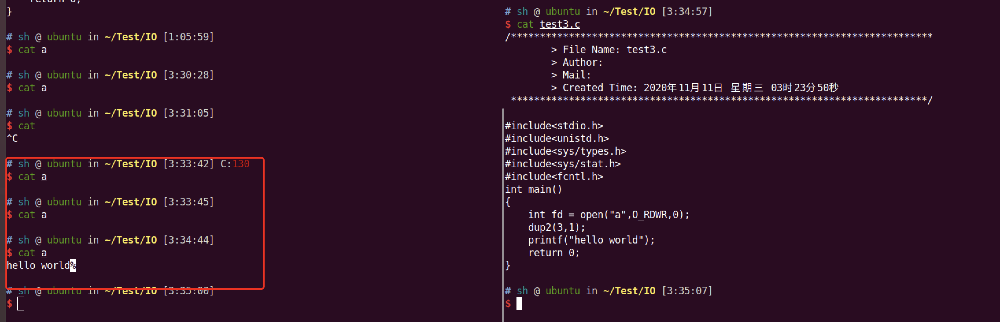

~~~C
#include<stdio.h>
#include<unistd.h>
#include<sys/types.h>
#include<sys/stat.h>
#include<fcntl.h>
int main()
{
    char c;
    int fd = open("a",O_RDONLY,0);
    int fd2 = open("a",O_RDONLY,0);
    read(fd2,&c,1);
    dup2(fd2,fd);
    read(fd,&c,1);
    printf("%c\n",c);
    return 0;
}
~~~

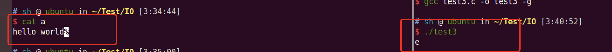

可以看到fd2和fd虽然是两个文件描述符，但是其实他们是相等的，所以`dup2(fd2,fd)`不会对文件描述符进行关闭，所以两个都可以用，又因为他们指向的是同一个文件，所以`文件位置`会出现叠加的情况。

~~~bash
pwndbg> info proc
process 16216
cmdline = '/home/sh/Test/IO/test3'
cwd = '/home/sh/Test/IO'
exe = '/home/sh/Test/IO/test3'
pwndbg> shell ls -l /proc/1621
16210/ 16213/ 16216/ 
pwndbg> shell ls -l /proc/16216/fd
总用量 0
lrwx------ 1 sh sh 64 11月 11 04:06 0 -> /dev/pts/0
lrwx------ 1 sh sh 64 11月 11 04:06 1 -> /dev/pts/0
lrwx------ 1 sh sh 64 11月 11 04:06 2 -> /dev/pts/0
lr-x------ 1 sh sh 64 11月 11 04:06 3 -> '/home/sh/Test/IO/a~ (deleted)'
lr-x------ 1 sh sh 64 11月 11 04:06 4 -> '/home/sh/Test/IO/a~ (deleted)'
~~~

在`/proc/pid/fd`里面存储文件相关内容。

## 标准IO

